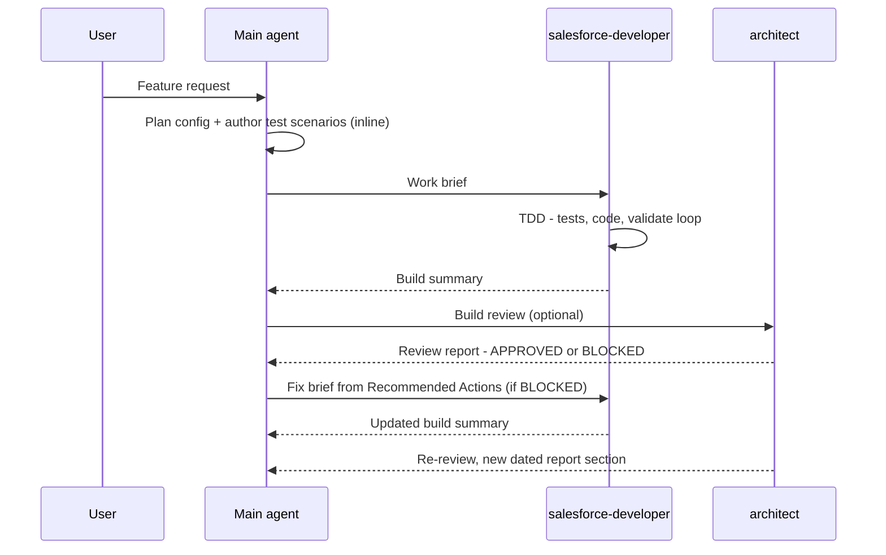

# sf-agentic-development

A developer productivity toolkit for **Claude Code**, **GitHub Copilot**, and **Codex** — skills and agents that keep you in the driver's seat while AI handles the heavy lifting.

These skills are standalone Salesforce code reviewers — point one at an existing codebase for a quality audit, an anti-pattern and performance sweep, or an ad-hoc review of bulk safety, security, and architecture. They *also* slot in automatically as a review pass over freshly generated code, because high-quality Salesforce code shouldn't rest on a single line of defense.

The skills encode hard-won Salesforce quality rules — bulk safety, security, architecture patterns, anti-patterns — that fire automatically based on what you're building.

The agents provide on-demand specialisation: the main agent plans config and QA inline, the `salesforce-developer` agent builds automation (Apex, LWC, Flows) in an isolated, parallelizable context, and the `architect` agent gives an independent technical review when you want one.

Agents are deliberately thin — the domain knowledge lives in the skills, which every agent shares. Project-specific constraints (e.g. additive-only, or reusing an existing logging framework) are passed in the work brief, not hardcoded into the agents.

This repo evolves continuously: new Salesforce releases, better agentic patterns, and improved practices get folded in over time.

---

## What's Inside

### Skills (authored)

| Skill | Covers |
|---|---|
| `reviewing-apex` | Governor limits, trigger design, security, architecture, async, error handling, testing |
| `reviewing-lwc` | Component architecture, data sourcing, directives, async/events, performance, Jest |
| `reviewing-flow` | Entry-condition discipline, loop/collection/Transform optimization, fault handling and Custom Error, async paths, recursion, hardcoded IDs, complexity, flow tests, naming |
| `deploying-sf-metadata` | Deployment safety rules, `package.xml` / git-delta (sgd) generation, validate → quick-deploy, CI/CD patterns, and SFDMU data deployments |

The apex/lwc/flow quality skills also bundle an optional **B2B Commerce** reference pack —
see [B2B Commerce projects](#b2b-commerce-projects).

### Agents

| Agent | Role |
|---|---|
| `salesforce-developer` | Receives a brief from the main agent; builds all automation — Apex (via TDD), LWC, Flows — in an isolated, parallelizable context; quality rules and project constraints come from the skills and brief; produces a build summary |
| `architect` | On-demand independent review — pre-implementation, post-implementation, or both; flags project-specific constraint violations (e.g. additive-only) only when the spec/brief/ADRs impose them; produces a gap-analysis report |

See [docs/ORCHESTRATION.md](docs/ORCHESTRATION.md) for the full workflow: the work-brief template, when to parallelize developer instances, and the review/fix loop.

### Baselines

`CLAUDE.md`, `AGENTS.md`, and `.github/copilot-instructions.md` are rendered from `templates/baseline.md` by `scripts/render-baselines.js` — one source of truth for **skill routing** across all three assistants. The baseline does one job: route to the right `generating-*` / `reviewing-*` skill (and chain them) from your project root, which fires reliably even in auto/autopilot modes where per-skill frontmatter triggers can be missed. Everything else stays in the skills — each skill carries its own safety rules, quality gates, and domain knowledge (including the B2B Commerce reference packs), and the agents ask for spec/architecture paths at dispatch time. The baseline is purely the routing layer on top of them.

---

## Using the review skills

Invoke a `reviewing-*` skill **by name** and point it at code you
already have. Each one is a complete Salesforce reviewer — the same governor-limit, security, and
architecture rules apply whether the code is five seconds or five years old — so it runs just as
well on an inherited org as on a line you just wrote. No generation step required.

| Use it for | Example prompt |
|---|---|
| **Ad-hoc code review** — one class, a PR diff, a file you're about to change | `/reviewing-apex` review `OrderService.cls` for bulk safety and security |
| **Codebase quality audit** — assess the overall health of an existing or inherited org; great for onboarding or scoping tech debt | `/reviewing-apex` can you scan the codebase and assess the quality of the existing codebase |
| **Anti-pattern / performance sweep** — surface what's making automations slow and inefficient | `/reviewing-apex` can you scan the codebase and find anti-patterns that exist that make the automations slow and not efficient |
| **LWC review** — component performance, wire/async patterns, Jest gaps | `/reviewing-lwc` audit the components under `force-app/**/lwc/` for performance, wire/async issues, and Jest gaps |
| **Flow review** — loop/collection efficiency, fault paths, recursion | `/reviewing-flow` scan my flows for Get-Records-in-loop, missing fault paths, and recursion |
| **Deployment / package.xml** — manifest and git-delta generation, validate/quick-deploy, CI/CD | `/deploying-sf-metadata` generate a package.xml from current commit HEAD to [commit hash or reference branch] |

These standalone reviews are the headline. The skills *also* fire automatically as a review pass
whenever a `generating-*` skill writes code — that authoring → review chain is described under
[Skill Routing](#skill-routing) below — but you don't need to be generating anything to use them.

---

## Setup

### Install (interactive)

From the **root of your Salesforce project** (requires Node 18+):

```bash
npx github:drsaavedra/sf-agentic-development
```

The installer asks which assistant you use (Claude Code / GitHub Copilot / Codex, arrow keys to
pick), then which skills, which optional domain reference packs (e.g. **B2B Commerce** — included
only if you check it, and only offered when a selected skill carries that pack), and which agents
to install (spacebar to toggle checkboxes, `a` to select all, Enter to confirm) — then copies your
picks into the right per-assistant directories and drops the matching baseline file (`CLAUDE.md`,
`.github/copilot-instructions.md`, or `AGENTS.md`) — the skill-routing layer — into your project
root.

These generated files are installed artifacts, not source — so the installer also adds them to your
project's `.gitignore` (creating it if absent, appending if present, and skipping entries already
there). For Claude that's `.claude/` and `CLAUDE.md`; for Codex `.agents/` and `AGENTS.md`; for
Copilot the specific `.github/skills/`, `.github/agents/`, and `.github/copilot-instructions.md`
(never all of `.github/`).

It then checks whether the toolkit's one dependency — `forcedotcom/sf-skills`, the
Salesforce-maintained base skills that do the generation this repo's quality gates sit on top
of — is already installed (project and user-level skill directories), and offers to run
`npx skills add` for it if it's missing. Behavioral-guideline skills are your choice, not a
dependency — see [Recommended companion skills](#recommended-companion-skills).

### After the installer

This step is only needed if you declined the installer's offer (or it couldn't detect an existing
install):

1. Install the Salesforce-maintained base skills — the official skills (`generating-apex`,
   `generating-lwc-components`, `deploying-metadata`, `querying-soql`, and more):
   ```bash
   npx skills add forcedotcom/sf-skills
   ```

There's nothing else to configure: the baseline is skill routing only, and the
`salesforce-developer` and `architect` agents ask for your technical-spec and architecture
document paths when you dispatch them.

### B2B Commerce projects

There is no separate B2B Commerce skill. The B2B Commerce Domain rules are folded into the three quality
skills as `references/commerce-b2b.md` — Apex backend rules under `reviewing-apex`,
storefront LWC rules under `reviewing-lwc`, and Commerce-object automation rules under
`reviewing-flow`. Each skill's routing table points at its `commerce-b2b.md` when the
artifact under review is a B2B Commerce storefront artifact, so the Commerce review pass rides the
quality skill's own trigger — no manual invoke.

The installer asks whether to include the **B2B Commerce** pack. Include it and the
`commerce-b2b.md` rules ride along inside the `reviewing-*` skills. Decline it and the
`commerce-b2b.md` files and their routing rows are stripped from the installed skills (the base
review rules are untouched). For a manual copy, just keep or delete `references/commerce-b2b.md`
in each skill.

### Repository layout

```
skills/<name>/              ← 4 authored Salesforce skills (canonical source: SKILL.md + references/)
agents/<name>.md            ← 2 Salesforce agents (canonical source)
templates/baseline.md       ← single-source template for the three root files below
scripts/render-baselines.js ← regenerates the three renders from the template
scripts/install.js          ← the interactive installer (npx entry point)
CLAUDE.md                   ← Claude Code baseline (rendered — do not edit directly)
AGENTS.md                   ← Codex baseline (rendered — do not edit directly)
.github/copilot-instructions.md ← Copilot baseline (rendered — do not edit directly)
```

| Assistant | Reads SKILL.md from |
|---|---|
| Claude Code | `.claude/skills/<name>/SKILL.md` |
| Copilot (VS Code) | `.claude/skills/`, `.github/skills/`, or `.agents/skills/` — any one |
| Codex | `.agents/skills/<name>/SKILL.md` |

All three use the same `name` + `description` frontmatter format.

<details>
<summary><strong>Manual setup (no installer)</strong></summary>

1. Copy the skills into the assistant-specific directory of your project:
   ```bash
   cp -r skills/* .claude/skills/    # Claude Code (Copilot also reads this)
   cp -r skills/* .github/skills/    # GitHub Copilot
   cp -r skills/* .agents/skills/    # Codex
   ```
2. Copy the agents:
   ```bash
   cp -r agents/* .claude/agents/    # Claude Code
   cp -r agents/* .github/agents/    # GitHub Copilot
   cp -r agents/* .agents/agents/    # Codex
   ```
3. Copy the matching baseline into your project root:

   | Assistant | File to copy |
   |---|---|
   | Claude Code | `CLAUDE.md` |
   | GitHub Copilot | `.github/copilot-instructions.md` |
   | Codex | `AGENTS.md` |

4. Continue with [After the installer](#after-the-installer) above.

</details>

---

## Skill Routing

The baseline's routing table maps each context to the right skill and fires it before any artifact is generated; each skill also declares its own trigger in its `description` frontmatter as a fallback. **Authoring always chains into review:** whenever a `generating-*` skill writes or edits code, the matching `reviewing-*` skill runs as a review pass over the result (`generating-apex`/`generating-apex-test` → `reviewing-apex`, `generating-lwc-components` → `reviewing-lwc`, `generating-flow` → `reviewing-flow`). The arrow rows below are that authoring → review chain; cross-domain work (LWC + Apex controller, Flow + invocable Apex) loads both relevant skills:

| Context | Skills — invoke in order |
|---|---|
| Apex classes / triggers / services | `generating-apex` → `reviewing-apex` |
| Apex test classes | `generating-apex-test` → `reviewing-apex` |
| LWC components | `generating-lwc-components` → `reviewing-lwc` |
| Flows | `generating-flow` → `reviewing-flow` |
| Review-only (no authoring) | `reviewing-apex` / `reviewing-lwc` / `reviewing-flow` |
| LWC + Apex controller | `reviewing-lwc` · `reviewing-apex` |
| Flow + Apex invocable | `reviewing-flow` · `reviewing-apex` |
| Deployment / package.xml / CI-CD | `deploying-sf-metadata` · `deploying-metadata` |

B2B Commerce storefront rules ride inside the `reviewing-*` skills via their optional `references/commerce-b2b.md` pack — no separate routing step. See [B2B Commerce projects](#b2b-commerce-projects).

### Making sure routing is followed

Each authored skill self-declares a file-glob `TRIGGER when:` clause in its `description`, so the review and deploy skills usually auto-activate once the relevant files (`.cls`, `.trigger`, `lwc/**`, `*.flow-meta.xml`, `package.xml`) are in play — no prompt needed. But the baseline lives in your project root, and agents don't always re-read it on every turn — especially right after you approve an implementation plan or tell the main agent to start coding. For belt-and-suspenders reliability, **name the baseline in that go-ahead prompt**:

> *"Proceed — and make sure to follow the skill routing in `CLAUDE.md`."*

Use the baseline file your assistant reads: `CLAUDE.md` (Claude Code), `AGENTS.md` (Codex), or `.github/copilot-instructions.md` (GitHub Copilot). The skill triggers handle *which* skill fires on a given file; naming the baseline re-anchors what a description can't — the authoring→review **ordering**, **review-only** routing, and **cross-domain pairing** (LWC+Apex controller, Flow+invocable Apex) — so the main agent chains the matching `reviewing-*` pass instead of writing code unrouted.

You only need this for the **main agent**. The `salesforce-developer` and `architect` agents already carry the skill routing in their own agent files, so a dispatched brief picks up the right skills automatically — no reminder needed.

---

## Agent Orchestration

How the main agent and the two repo agents work together on a feature. The pattern is adapted
from [Agentic Project Management (APM)](https://github.com/sdi2200262/agentic-project-management):
self-contained task briefs, progress tracked through summaries rather than raw code, and
dependency-aware dispatch.

### The lifecycle



> **What the gates actually catch:** asked to add Account address verification against a vendor API,
> the `architect` reviewed the *design* — before any code — and blocked it: one synchronous callout
> per changed record means a 200-record data-loader update fires 200 callouts in a single
> transaction, over the 100-callout limit, so the bulk path fails by design. It also flagged the API
> key sitting readable in custom metadata (belongs behind a Named Credential) and a missing
> retry/status path. Three flaws fixed before a line of Apex existed.

The full working guide — the lifecycle steps, the work-brief template, dispatch rules, checkpoint
commits, prompting guidance, and four worked examples (including the one above) — lives in
**[docs/ORCHESTRATION.md](docs/ORCHESTRATION.md)**.

---

## Roadmap

This toolkit is a developer productivity tool today — you stay at the wheel. The direction it's
heading is an **autonomous delivery workflow**: agents that build, test, and deploy Salesforce
solutions from a rigorous design contract, escalating only at genuine gaps. The human's role moves
from *operator* (approving each command) to *author* (curating the design the workflow executes).
The full rationale and target operating model live in [docs/VISION.md](docs/VISION.md).

The capability gaps between today's tool and that target, in build order — the first is the
keystone that makes autonomy safe to grant:

1. **Design contract + completeness gate** *(keystone)* — a machine-checkable CONTEXT/spec schema
   and a gate that refuses to build an incomplete design. Makes autonomy safe to grant.
2. **Autonomy + escalation model** — convert today's human-confirmation safety gates to
   machine-gated conditions, plus a concrete "genuine gap" detector and the autonomy boundaries
   (what never gets delegated).
3. **Self-verifying build/deploy loop** — the validate→correct→re-validate loop closes itself:
   retry budget, machine-checkable "done," automatic BLOCKED→fix routing.
4. **Durable run state** — a persisted work-ledger (done / blocked / deployed-where) so a long run
   survives context compaction and is auditable, instead of living only in chat context.
5. **Environment ladder** — total autonomy through scratch orgs and CI sandboxes; a human
   signature kept at production.

> Direction-setting, not a commitment schedule. Today's human-at-the-wheel safety rules stay in
> force until each gate above is built and proven.

---

## Recommended companion skills

This toolkit is deliberately Salesforce-only: `forcedotcom/sf-skills` does the base generation
(maintained by Salesforce), and the authored `salesforce-*` skills add the quality gates. It
takes no opinion on general coding-behavior skills — those are a personal preference, so the
toolkit requires none. If you want one, two good options:

- **[andrej-karpathy-skills](https://github.com/forrestchang/andrej-karpathy-skills)** —
  behavioral guidelines that curb common LLM coding mistakes (overcomplication, sweeping
  changes, unstated assumptions). Install as a plugin:
    ```
    /plugin marketplace add forrestchang/andrej-karpathy-skills
    /plugin install andrej-karpathy-skills@karpathy-skills
    ```
- **[Superpowers](https://github.com/obra/superpowers)** — workflow skills for brainstorming,
  plan-writing, TDD, and systematic debugging. Install as a plugin:
    ```
    /plugin marketplace add obra/superpowers-marketplace
    /plugin install superpowers@superpowers-marketplace
    ```

Neither is wired into anything — if you install one, it activates on its own triggers
alongside the Salesforce skills.

---

## Maintaining

- **Skills & agents** — `skills/` and `agents/` are the only source of truth. Edit `skills/<name>/` (the `SKILL.md` and its `references/`) or `agents/<name>.md`, then re-run the installer (or re-copy) into the per-assistant directories. Never edit the installed copies — changes are lost on the next install.
- **Baselines** — edit `templates/baseline.md` (its header comment documents the template token syntax), then run `node scripts/render-baselines.js` (or `npm run render`) to regenerate the three renders. Never edit `CLAUDE.md`, `AGENTS.md`, or `.github/copilot-instructions.md` by hand.

## License

[MIT](LICENSE)
