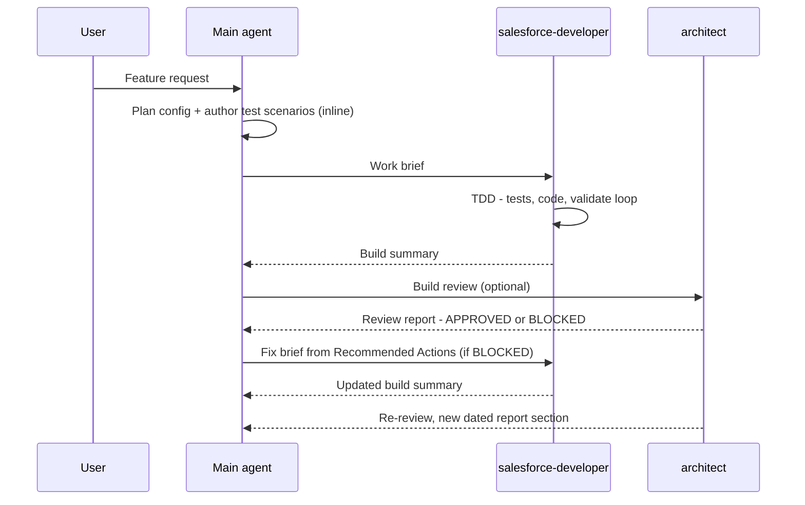

# sf-agentic-development

A developer productivity toolkit for **Claude Code**, **GitHub Copilot**, and **Codex** — skills and agents that keep you in the driver's seat while AI handles the heavy lifting.

The **skills** are standalone Salesforce code reviewers encoding hard-won quality rules — bulk safety, security, architecture, anti-patterns. Point one at an existing codebase for a quality audit or performance sweep, or let it slot in automatically as a review pass over freshly generated code.

The **agents** add on-demand specialisation: the `salesforce-developer` agent builds automation (Apex, LWC, Flows) in an isolated, parallelizable context, and the `architect` agent gives an independent technical review when you want one. Agents are deliberately thin — the domain knowledge lives in the shared skills; project-specific constraints (e.g. additive-only) are passed in the work brief, not hardcoded.

---

## What's Inside

### Skills (authored)

| Skill | Covers |
|---|---|
| `reviewing-apex` | Governor limits, trigger design, security, architecture, async, error handling, testing |
| `reviewing-lwc` | Component architecture, data sourcing, directives, async/events, performance, Jest |
| `reviewing-flow` | Entry-condition discipline, loop/collection/Transform optimization, fault handling and Custom Error, async paths, recursion, hardcoded IDs, complexity, flow tests, naming |
| `deploying-sf-metadata` | Deployment safety rules, `package.xml` / git-delta (sgd) generation, validate → quick-deploy, CI/CD patterns, and SFDMU data deployments |

The apex/lwc/flow quality skills also bundle an optional **B2B Commerce** reference pack —
see [Domain Specific skills](#domain-specific-skills).

For **planned feature work**, two workflow skills — `sf-plan` and `sf-build` — drive a plan→build
pipeline end to end; see [Planning and building a feature](#planning-and-building-a-feature).

### Agents

| Agent | Role |
|---|---|
| `salesforce-developer` | Receives a brief from the main agent; builds all automation — Apex (via TDD), LWC, Flows — in an isolated, parallelizable context; quality rules and project constraints come from the skills and brief; produces a build summary |
| `architect` | On-demand independent review — pre-implementation, post-implementation, or both; flags project-specific constraint violations (e.g. additive-only) only when the spec/brief/ADRs impose them; produces a gap-analysis report |

See [docs/ORCHESTRATION.md](docs/ORCHESTRATION.md) for the full workflow: the work-brief template, when to parallelize developer instances, and the review/fix loop.

### Baselines

`CLAUDE.md`, `AGENTS.md`, and `.github/copilot-instructions.md` are rendered from `templates/baseline.md` — one source of truth for **skill routing** across all three assistants. The baseline does one job: route to the right `generating-*` / `reviewing-*` skill and chain them. Everything else — safety rules, quality gates, domain knowledge (including the B2B Commerce packs) — lives in the skills themselves.

---

## Using the review skills

Invoke a `reviewing-*` skill **by name** and point it at code you already have. Each is a complete
Salesforce reviewer — the same governor-limit, security, and architecture rules apply to an
inherited org as to a line you just wrote. No generation step required.

| Use it for | Example prompt |
|---|---|
| **Ad-hoc code review** — one class, a PR diff, a file you're about to change | `/reviewing-apex` review `OrderService.cls` for bulk safety and security |
| **Codebase quality audit** — assess the overall health of an existing or inherited org; great for onboarding or scoping tech debt | `/reviewing-apex` can you scan the codebase and assess the quality of the existing codebase |
| **Anti-pattern / performance sweep** — surface what's making automations slow and inefficient | `/reviewing-apex` can you scan the codebase and find anti-patterns that exist that make the automations slow and not efficient |
| **LWC review** — component performance, wire/async patterns, Jest gaps | `/reviewing-lwc` audit the components under `force-app/**/lwc/` for performance, wire/async issues, and Jest gaps |
| **Flow review** — loop/collection efficiency, fault paths, recursion | `/reviewing-flow` scan my flows for Get-Records-in-loop, missing fault paths, and recursion |
| **Deployment / package.xml** — manifest and git-delta generation, validate/quick-deploy, CI/CD | `/deploying-sf-metadata` generate a package.xml from current commit HEAD to [commit hash or reference branch] |

The skills *also* fire automatically as a review pass whenever a `generating-*` skill writes code —
the authoring → review chain under [Skill Routing](#skill-routing) below — but standalone use needs
no generation step.

### Domain Specific skills

There is no separate skill per domain. The Commerce Domain rules are folded into the three
`reviewing-*` skills as optional `references/commerce-b2b.md` — Apex backend rules under
`reviewing-apex`, storefront LWC under `reviewing-lwc`, Commerce-object automation under
`reviewing-flow` — and ride each skill's own trigger when the artifact is a Commerce storefront
artifact, no manual invoke.

Include the pack via the installer's prompt, or keep/delete `references/commerce-b2b.md` manually.
Declining it strips only those files; the base review rules are untouched.

---

## Planning and building a feature

For a *planned* feature — not an ad-hoc fix — two skills form a deliberate pipeline:

- **`/sf-plan`** explores your code and org, then grills you to shared understanding (one prose
  question at a time, with recommended choices) — settling the overall solution shape before the
  per-capability declarative-vs-code calls — verifies the schema, and writes a completeness-checked
  design contract to `docs/tech-spec.md`. Run it again when requirements change and it **revises the
  existing spec in place**, grilling the change against the prior decisions instead of overwriting.
- **`/sf-build`** builds and reviews against that contract: it dispatches the config skills and the
  `salesforce-developer` agent per work item, then runs the `reviewing-*` battery as a gate.
  Deploys stay human-gated.

You review the spec between the two steps — `/sf-build` won't fire straight out of planning. This
is the **planned** path; for everything else — ad-hoc edits, fixes, reviews, audits, single config
items — use the skills under [Skill Routing](#skill-routing) directly.

### Example

```text
/sf-plan I want to build a datatable that shows Account records and the fields Salutation,
Name, AccountNumber, Phone, Rating and has a button to show the child contacts under the
chosen account
```

`/sf-plan` reads your org and existing components first, then grills the open decisions with a
recommendation for each:

- *"A datatable with a row action points to an **LWC** rather than a Screen Flow — agree?"*
- *"Where should it live — an Account record page, an app page, or an Experience Cloud page?"*
- *"What should the button do — open the child contacts in a modal, navigate to a list, or expand the row inline?"*

Once you've agreed, it writes `docs/tech-spec.md` (the LWC, its Apex controller, the child-contacts
view, and test scenarios). You review it, then `/sf-build` builds and reviews against that spec.

**Grounding (no runtime dependency).** `/sf-plan` makes its declarative-vs-code calls from curated
decision packs bundled with the skill (`skills/sf-plan/references/`) — not from the model's memory,
and **not by fetching docs at runtime**, so the repo stays lightweight and ships no Playwright or
network dependency. The packs are kept current against official Salesforce documentation by the
maintainer and re-validated every release (see [Maintaining](#maintaining)). What's written here is
vetted, not guessed.

Full detail — the grilling pattern, the spec / work-item contract, why it replaces plan mode, and
how it feeds the agents — is in **[docs/PIPELINE.md](docs/PIPELINE.md)**.

---

## Setup

### Install (interactive)

From the **root of your Salesforce project** (requires Node 18+):

```bash
npx github:drsaavedra/sf-agentic-development
```

### After the installer

Only needed if you declined the installer's offer (or it couldn't detect an existing install) —
install the Salesforce base skills (`generating-apex`, `generating-lwc-components`,
`deploying-metadata`, `querying-soql`, and more):

```bash
npx skills add forcedotcom/sf-skills
```

Nothing else to configure: the baseline is skill routing only, and the `salesforce-developer` and
`architect` agents ask for your spec/architecture paths when you dispatch them.

### Repository layout

```
skills/<name>/              ← 4 authored Salesforce skills (canonical source: SKILL.md + references/)
agents/<name>.md            ← 2 Salesforce agents (canonical source)
templates/baseline.md       ← single-source template for the three root files below
scripts/render-baselines.js ← regenerates the three renders from the template
scripts/install.js          ← the interactive installer (npx entry point)
CLAUDE.md                   ← Claude Code baseline (rendered — do not edit directly)
AGENTS.md                   ← Codex baseline (rendered — do not edit directly)
.github/copilot-instructions.md ← Copilot baseline (rendered — do not edit directly)
```

| Assistant | Reads SKILL.md from |
|---|---|
| Claude Code | `.claude/skills/<name>/SKILL.md` |
| Copilot (VS Code) | `.claude/skills/`, `.github/skills/`, or `.agents/skills/` — any one |
| Codex | `.agents/skills/<name>/SKILL.md` |

All three use the same `name` + `description` frontmatter format.

<details>
<summary><strong>Manual setup (no installer)</strong></summary>

1. Copy the skills into the assistant-specific directory of your project:
   ```bash
   cp -r skills/* .claude/skills/    # Claude Code (Copilot also reads this)
   cp -r skills/* .github/skills/    # GitHub Copilot
   cp -r skills/* .agents/skills/    # Codex
   ```
2. Copy the agents:
   ```bash
   cp -r agents/* .claude/agents/    # Claude Code
   cp -r agents/* .github/agents/    # GitHub Copilot
   cp -r agents/* .agents/agents/    # Codex
   ```
3. Copy the matching baseline into your project root:

   | Assistant | File to copy |
   |---|---|
   | Claude Code | `CLAUDE.md` |
   | GitHub Copilot | `.github/copilot-instructions.md` |
   | Codex | `AGENTS.md` |

4. Continue with [After the installer](#after-the-installer) above.

</details>

---

## Skill Routing

**Authoring chains into review:** whenever a `generating-*` skill writes code, the matching `reviewing-*` skill runs as a review pass over the result. The arrow rows below are that chain; cross-domain work (LWC + Apex controller, Flow + invocable Apex) loads both skills. Each skill also self-triggers from its `description` frontmatter on the relevant file types as a fallback.

| Context | Skills — invoke in order |
|---|---|
| Apex classes / triggers / services | `generating-apex` → `reviewing-apex` |
| Apex test classes | `generating-apex-test` → `reviewing-apex` |
| LWC components | `generating-lwc-components` → `reviewing-lwc` |
| Flows | `generating-flow` → `reviewing-flow` |
| Review-only (no authoring) | `reviewing-apex` / `reviewing-lwc` / `reviewing-flow` |
| LWC + Apex controller | `reviewing-lwc` · `reviewing-apex` |
| Flow + Apex invocable | `reviewing-flow` · `reviewing-apex` |
| Deployment / package.xml / CI-CD | `deploying-sf-metadata` · `deploying-metadata` |

B2B Commerce storefront rules ride inside the `reviewing-*` skills via their optional `references/commerce-b2b.md` pack — no separate routing step. See [Domain Specific skills](#domain-specific-skills).

### Making sure routing is followed

Skills auto-activate once the relevant files (`.cls`, `.trigger`, `lwc/**`, `*.flow-meta.xml`, `package.xml`) are in play. But the baseline lives in your project root and the **main agent** doesn't always re-read it — especially right after you approve a plan and say "start coding." For belt-and-suspenders reliability, name the baseline in that go-ahead prompt:

> *"Proceed — and follow the skill routing in `CLAUDE.md`."* (or `AGENTS.md` / `.github/copilot-instructions.md`)

This re-anchors the authoring→review **ordering** and **cross-domain pairing** that a per-file trigger can't. The `salesforce-developer` and `architect` agents carry the routing in their own files, so dispatched briefs need no reminder.

---

## Agent Orchestration

How the main agent and the two repo agents work together on a feature. The pattern is adapted
from [Agentic Project Management (APM)](https://github.com/sdi2200262/agentic-project-management):
self-contained task briefs, progress tracked through summaries rather than raw code, and
dependency-aware dispatch.

### The lifecycle



> **What the gates actually catch:** asked to add Account address verification via a vendor API, the
> `architect` reviewed the *design* before any code and blocked it — a synchronous callout per record
> blows the 100-callout limit on a 200-record load. Three flaws fixed before a line of Apex existed.

The full working guide — lifecycle steps, the work-brief template, dispatch rules, checkpoint
commits, and four worked examples — lives in **[docs/ORCHESTRATION.md](docs/ORCHESTRATION.md)**.

---

## Roadmap

This toolkit is a developer productivity tool today — you stay at the wheel. The direction is an
**autonomous delivery workflow**: agents that build, test, and deploy from a rigorous design
contract, escalating only at genuine gaps, with the human moving from *operator* to design
*author*. The capability gaps to get there, in build order (the first is the keystone that makes
autonomy safe to grant):

1. **Design contract + completeness gate** *(keystone)* — refuses to build an incomplete design.
2. **Autonomy + escalation model** — machine-gated safety conditions plus a "genuine gap" detector.
3. **Self-verifying build/deploy loop** — validate→correct→re-validate closes itself.
4. **Durable run state** — a persisted work-ledger so a long run survives context compaction.
5. **Environment ladder** — full autonomy through sandboxes; a human signature kept at production.

Full rationale and operating model in [docs/VISION.md](docs/VISION.md). Direction-setting, not a
commitment schedule — today's safety rules hold until each gate is built and proven.

---

## Recommended companion skills

This toolkit is deliberately Salesforce-only and takes no opinion on general coding-behavior
skills — they're optional. Two good options if you want one:

- **[andrej-karpathy-skills](https://github.com/forrestchang/andrej-karpathy-skills)** —
  behavioral guidelines that curb common LLM coding mistakes (overcomplication, sweeping
  changes, unstated assumptions). Install as a plugin:
    ```
    /plugin marketplace add forrestchang/andrej-karpathy-skills
    /plugin install andrej-karpathy-skills@karpathy-skills
    ```
- **[Superpowers](https://github.com/obra/superpowers)** — workflow skills for brainstorming,
  plan-writing, TDD, and systematic debugging. Install as a plugin:
    ```
    /plugin marketplace add obra/superpowers-marketplace
    /plugin install superpowers@superpowers-marketplace
    ```

Neither is wired into anything — if you install one, it activates on its own triggers
alongside the Salesforce skills.

---

## Maintaining

- **Skills & agents** — `skills/` and `agents/` are the only source of truth. Edit them, then re-run the installer (or re-copy) into the per-assistant directories. Never edit the installed copies — they're lost on the next install.
- **Baselines** — edit `templates/baseline.md`, then run `node scripts/render-baselines.js` (or `npm run render`) to regenerate the three renders. Never edit `CLAUDE.md`, `AGENTS.md`, or `.github/copilot-instructions.md` by hand.
## License

[MIT](LICENSE)
