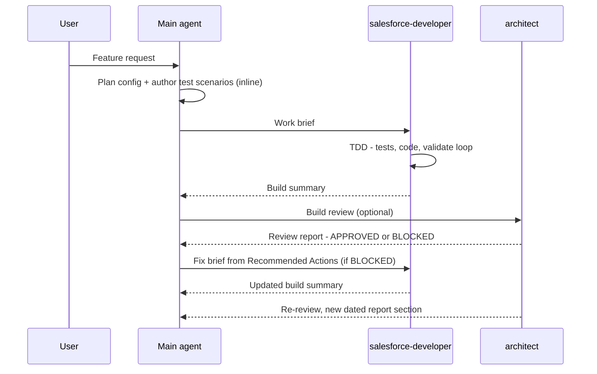

# sf-agentic-development

A developer productivity toolkit for **Claude Code**, **GitHub Copilot**, and **Codex** — skills and agents that keep you in the driver's seat while AI handles the heavy lifting.

The skills encode hard-won Salesforce quality rules — bulk safety, security, architecture patterns, anti-patterns — that fire automatically based on what you're building.

The agents provide on-demand specialisation. The main agent handles config planning and QA reasoning inline, since it already has your conversation context. The `salesforce-developer` agent runs Apex work in an isolated context, parallelizable across several instances at once. The `architect` agent gives you an independent technical review when you want one. How the three work together — the work brief, dispatch rules, and review loop — is covered in [Agent Orchestration](#agent-orchestration).

Agents are deliberately thin — the domain knowledge lives in the skills, which every agent shares. Project-specific constraints (e.g. additive-only, or reusing an existing logging framework) are passed in the work brief, not hardcoded into the agents.

This repo evolves continuously: new Salesforce releases, better agentic patterns, and improved practices get folded in over time. See [CHANGELOG.md](CHANGELOG.md) for what changed between pulls.

---

## What's Inside

### Skills (authored)

| Skill | Covers |
|---|---|
| `salesforce-apex-quality` | Governor limits, trigger design, security, architecture, async, error handling, testing |
| `salesforce-lwc-quality` | Component architecture, data sourcing, directives, async/events, performance, Jest |
| `salesforce-flow-quality` | Entry-condition discipline, loop/collection/Transform optimization, fault handling and Custom Error, async paths, recursion, hardcoded IDs, complexity, flow tests, naming |
| `salesforce-deployment` | Deployment safety rules, `package.xml` / git-delta (sgd) generation, validate → quick-deploy, CI/CD patterns, and SFDMU data deployments |
| `salesforce-commerce-b2b` | B2B Commerce domain rules |

### Agents

| Agent | Role |
|---|---|
| `salesforce-developer` | Receives a brief from the main agent; builds Apex following TDD in an isolated, parallelizable context; quality rules and project constraints come from the skills and brief; produces a build summary |
| `architect` | On-demand independent review — pre-implementation, post-implementation, or both; flags project-specific constraint violations (e.g. additive-only) only when the spec/brief/ADRs impose them; produces a gap-analysis report |

See [Agent Orchestration](#agent-orchestration) for the full workflow: the work-brief template, when to parallelize developer instances, and the review/fix loop.

### Baselines

`CLAUDE.md`, `AGENTS.md`, and `.github/copilot-instructions.md` are rendered from `templates/baseline.md` by `scripts/render-baselines.js` — one source of truth for skill routing, safety rules, and the agent→doc map across all three assistants.

---

## Setup

### Install (interactive)

From the **root of your Salesforce project** (requires Node 18+):

```bash
npx github:drsaavedra/sf-agentic-development
```

The installer asks four questions — which assistant you use (Claude Code / GitHub Copilot /
Codex, arrow keys to pick), which skills and which agents to install (spacebar to toggle
checkboxes, `a` to select all, Enter to confirm), and whether this is a B2B Commerce
project — then copies your picks into the right per-assistant directories, drops the matching
baseline file (`CLAUDE.md`, `.github/copilot-instructions.md`, or `AGENTS.md`) into your
project root, and sets the Commerce flag in it if you said yes.

It then checks whether the two dependencies — `forcedotcom/sf-skills` and the Karpathy
behavioral guidelines — are already installed (project and user-level skill directories), and
offers to run `npx skills add` for anything missing. The one thing it can't do for you: the
Karpathy **plugin** for Claude Code is installed with `/plugin` commands inside Claude Code,
so it prints those instead.

### After the installer

Steps 1–2 are only needed if you declined the installer's offers (or it couldn't detect an
existing install); steps 3–4 always apply:

1. Install the community Salesforce skills — 50+ official skills (`generating-apex`,
   `generating-lwc-components`, `deploying-metadata`, `querying-soql`, and more):
   ```bash
   npx skills add forcedotcom/sf-skills
   ```
2. Install the Karpathy behavioral guidelines:
   - **Claude Code** (plugin — updates flow through automatically):
     ```
     /plugin marketplace add forrestchang/andrej-karpathy-skills
     /plugin install andrej-karpathy-skills@karpathy-skills
     ```
   - **Codex / Copilot** (no plugin support — install as a skill):
     ```bash
     npx skills add forrestchang/andrej-karpathy-skills
     ```
3. Fill in the baseline's **Agent → Spec Doc Map** section with your project's spec document paths.
4. *(Optional)* [Superpowers](https://superpowers.ai) for brainstorming, plan-writing, TDD, and
   debugging workflow skills.

### Commerce projects

`salesforce-commerce-b2b` is **gated on the Commerce flag in the baseline's Project Conventions
section**, never on file content. When set, it overlays the `generating-*` skill during
authoring (so generated Apex/LWC/Flow is Commerce-aware from the start) and chains after the
matching `salesforce-*-quality` skill as a Commerce-domain review pass.

Three ways to set it: answer **yes** to the installer's Commerce question, edit the **Current
setting** line in the baseline's **Commerce project flag** bullet, or simply tell the agent
*"This is a Commerce project"* and let it update the section. One-time setup — once set, the
routing applies on every Apex/LWC/Flow task, the same across all three assistants.

Leave the flag unset for non-Commerce orgs — the skill then never fires. For a mixed
CRM+Commerce org, either set the flag (and accept the overlay + review chain on all
Apex/LWC/Flow work) or leave it unset and invoke `salesforce-commerce-b2b` manually on the
Commerce pieces.

### Repository layout

```
skills/<name>/              ← 5 authored Salesforce skills (canonical source: SKILL.md + references/)
agents/<name>.md            ← 2 Salesforce agents (canonical source)
templates/baseline.md       ← single-source template for the three root files below
scripts/render-baselines.js ← regenerates the three renders from the template
scripts/install.js          ← the interactive installer (npx entry point)
CLAUDE.md                   ← Claude Code baseline (rendered — do not edit directly)
AGENTS.md                   ← Codex baseline (rendered — do not edit directly)
.github/copilot-instructions.md ← Copilot baseline (rendered — do not edit directly)
```

| Assistant | Reads SKILL.md from |
|---|---|
| Claude Code | `.claude/skills/<name>/SKILL.md` |
| Copilot (VS Code) | `.claude/skills/`, `.github/skills/`, or `.agents/skills/` — any one |
| Codex | `.agents/skills/<name>/SKILL.md` |

All three use the same `name` + `description` frontmatter format.

<details>
<summary><strong>Manual setup (no installer)</strong></summary>

1. Copy the skills into the assistant-specific directory of your project:
   ```bash
   cp -r skills/* .claude/skills/    # Claude Code (Copilot also reads this)
   cp -r skills/* .github/skills/    # GitHub Copilot
   cp -r skills/* .agents/skills/    # Codex
   ```
2. Copy the agents:
   ```bash
   cp -r agents/* .claude/agents/    # Claude Code
   cp -r agents/* .github/agents/    # GitHub Copilot
   cp -r agents/* .agents/agents/    # Codex
   ```
3. Copy the matching baseline into your project root:

   | Assistant | File to copy |
   |---|---|
   | Claude Code | `CLAUDE.md` |
   | GitHub Copilot | `.github/copilot-instructions.md` |
   | Codex | `AGENTS.md` |

4. Continue with [After the installer](#after-the-installer) above; for Commerce orgs, set the
   flag as described in [Commerce projects](#commerce-projects).

</details>

---

## Skill Routing

The baseline routes to the right skill automatically based on context. Cross-domain work (LWC + Apex controller, Flow + invocable Apex) loads both relevant skills:

| Context | Skills |
|---|---|
| Apex classes / triggers / services | `generating-apex` · `salesforce-apex-quality` |
| Apex test classes | `generating-apex-test` · `salesforce-apex-quality` |
| LWC components | `generating-lwc-components` · `salesforce-lwc-quality` |
| LWC + Apex controller | `salesforce-lwc-quality` · `salesforce-apex-quality` |
| Flows | `generating-flow` · `salesforce-flow-quality` |
| Flow + Apex invocable | `salesforce-flow-quality` · `salesforce-apex-quality` |
| Deployment / package.xml / CI-CD | `salesforce-deployment` · `deploying-metadata` |
| B2B Commerce *(when the Commerce flag is set)* | `salesforce-commerce-b2b` — overlay during authoring + review pass after the quality skill |

---

## Agent Orchestration

How the main agent and the two repo agents work together on a feature. The pattern is adapted
from [Agentic Project Management (APM)](https://github.com/sdi2200262/agentic-project-management):
self-contained task briefs, progress tracked through summaries rather than raw code, and
dependency-aware dispatch. Three APM mechanisms were deliberately **not** adopted — the file-based
message bus and handoff procedures (Claude Code / Copilot / Codex subagents pass context natively
via prompt and result), and the separate Planner agent (the main agent plans inline because it
already holds your conversation context).

### The lifecycle



1. **Plan inline** — the main agent designs the config (objects, fields, access) and authors the
   QA/test scenarios in conversation with you. No planner agent — the main agent already has the
   context.
2. **Compose a work brief** — one brief per unit of dev work, using the template below.
3. **Dispatch `salesforce-developer`** — one instance, or several in parallel (dispatch rules below).
4. **Developer builds via TDD** — tests first, minimum implementation, validate-deploy loop until
   green — then writes the **build summary** (default `docs/dev-build-summary.md`).
5. **Main agent reads the build summary, not the raw code** — the summary is the integration
   point: it tells the main agent what exists, which scenarios passed, and what the next brief can
   depend on.
6. **Invoke `architect` when you want a gate** — design review before coding, build review after,
   or both. On-demand, never mandatory.
7. **Fix loop** — a **BLOCKED** review goes back to `salesforce-developer` as a new brief built
   from the report's Recommended Actions; the architect re-reviews after the fix and appends a new
   dated section to the report (the report is append-only history).
8. **You gate the irreversible steps** — validates and deploys are confirmed per the baseline's
   safety rules, and you can review any brief or report before the next agent acts on it.

### The work brief

The brief is what makes the developer agent effective in an isolated context: it must be
**self-contained**. Schema and spec content the task needs is embedded in the brief — a bare
path reference forces the agent to rediscover context it can't see from your conversation.

```markdown
## Work Brief — <task name>

**Objective** — <what to build, one paragraph>
**Spec reference** — <path + relevant sections>
**Schema context** — <objects, fields, relationships this code touches — embedded, not just referenced>
**Test scenarios** — <concrete cases: given / when / then>
**Constraints** — <project-specific rules, e.g. additive-only, reuse the existing logging framework — or "none">
**Dependencies** — <outputs of prior tasks this builds on: file paths, method signatures, integration guidance — or "none">
**Expected outputs** — <classes / triggers to produce + the build summary>
**Validation criteria** — <all scenarios green, ≥85% coverage per class, analyzer clean>
```

| Field | What goes in it |
|---|---|
| Objective | The unit of work in plain language — what exists when this brief is done |
| Spec reference | Path to the Technical Specification (also in the baseline's Agent → Spec Doc Map) plus the sections that apply to this task |
| Schema context | The data model the code touches, written out in the brief. The developer runs isolated — don't make it rediscover the schema. Gather it verified, not guessed: `sf sobject describe` and read-only queries against the org (the baseline's "Org introspection & schema truth" rule) |
| Test scenarios | The TDD requirements. The developer writes these as failing tests first, so they must be concrete enough to assert on |
| Constraints | Project-specific rules from the spec or your conversation. Constraints live in the brief, never hardcoded in the agent |
| Dependencies | What earlier briefs produced that this one consumes — paths, signatures, and how to integrate |
| Expected outputs | The artifact list, so "done" is checkable |
| Validation criteria | The exit condition the developer loops against before reporting back |

If a brief lacks test scenarios or validation criteria, the developer agent asks instead of
inventing requirements — write them before dispatching.

### Dispatch rules — parallel or sequential?

- **Independent work items** (separate objects or domains, no shared classes) → **parallel**
  developer instances, one brief each.
- **Dependent chain** (a service class consumed by a trigger handler) → **one** instance, the
  chain sequenced inside a single brief. The agent that built the producer already knows it —
  don't split the chain across instances.
- **Unavoidable cross-instance dependency** → the consuming brief embeds a comprehensive summary
  of the producer's output (file paths, method signatures, integration guidance) taken from the
  producer's build summary — or, when dispatching both sides in parallel before either exists,
  the **contract** (method signatures, public APIs, schema) pinned by the main agent up front
  and embedded in both briefs. Integration is then verified with one combined validate at the
  merge point.

### Checkpoint commits (opt-in)

The baseline's git safety rule means a long multi-brief run normally accumulates everything in
the working tree — if work item four goes sideways, there is no stable point to roll back to.
**Checkpoint mode** trades a single explicit grant for rollback safety, the same shape as the
TDD validate-loop exception (confirm once, then iterate automatically):

1. **Grant** — you enable it in the prompt for one task: *"checkpoint as you go"*, *"enable
   checkpoint commits"*, or any equally explicit wording — exact phrases aren't required, and
   you can narrow the grant (e.g. *"only checkpoint completed work items, not every validate"*).
   What never activates it: plan approval alone, or the agent inferring it because the run is
   long — the agent never turns checkpoint mode on by itself. The grant expires when the task
   completes; the next task needs a fresh one.
2. **Branch** — the main agent creates `checkpoint/<task-slug>` from the current HEAD and
   commits only there; your original branch is never committed to. If the working tree is dirty
   at grant time, the agent asks once whether to record a `checkpoint: baseline (pre-task
   state)` commit first.
3. **Stable points** — commits happen only at: a green validate, a completed work item (the
   commit includes its build summary), or immediately before a risky/hard-to-undo step. Messages
   follow `checkpoint: <work item> — <state>`. Only the main agent commits — developer and
   architect agents never run git — and parallel dispatches checkpoint only at merge points, so
   a commit never captures another instance's partial work.
4. **Wrap-up** — at task end the agent reports the branch name and the checkpoint list. Rolling
   back to a checkpoint, merging or squashing the branch into your branch, pushing, and deleting
   the branch all remain explicit requests from you.

The full rule lives in the baseline's Git safety section (Priority 1).

### Prompting a pattern

You never have to name a pattern. Describe the build, and the main agent derives the dispatch
shape from the baseline's orchestration rules: dependent chain → one instance, independent
items → parallel, review only when you ask for it. The work brief happens regardless — it's
how every dispatch is packaged.

You steer with three levers: **how you scope the work** (one feature vs. several independent
pieces), **whether you ask for parallelism or contract pinning**, and **whether you request an
architect gate** (it is on-demand, never automatic). Example prompts:

| Pattern | What you'd type |
|---|---|
| 1 — Dependent chain + fix loop | *"Implement the won-opportunity rollup from spec §4.2 — send it to the developer agent, then have the architect review the build."* |
| 2 — Contract-first parallel dispatch | *"Build a reusable datatable LWC driven by custom metadata, plus versions for Account, Contact, and Opportunity. Pin the contracts first and run the dev work in parallel where the pieces allow it."* |
| 3 — Self-contained work brief | *"Implement case SLA escalation from spec §5.3 with the developer agent. Put everything it needs — queues, record types, the business-hours rule — in the brief."* |
| 4 — Build summary as integration point | *"Now add auto-conversion of qualified leads. Reuse the LeadConvertService from the build summary — brief the developer from that entry, don't re-read the class."* |
| 5 — Full task loop, repeated | *"Work through the data-hygiene jobs in spec §5.1 one at a time: brief, build, then show me the build summary before you start the next one."* |
| 6 — Review gates at both ends | *"We need address verification on Accounts against the vendor API. Have the architect clear the design before any code is written, and review the build afterwards."* |

The italicized phrases are the levers: *"in parallel where the pieces allow it"*, *"pin the
contracts first"*, *"from the build summary"*, *"one at a time"*, *"before any code is
written"*, *"checkpoint as you go"*. Leave them out and the main agent still picks a sane shape — sequential, briefed,
no review — and you can redirect at any checkpoint. Each worked example below opens with its
kickoff prompt.

### Worked examples

Standard-object scenarios, one per orchestration pattern — each based on a build the Salesforce
community demonstrably does a lot (sources linked inside). All collapsed — expand the one that
matches the situation you're in.

| # | Pattern | Scenario |
|---|---|---|
| 1 | Dependent chain + fix loop | Opportunity rollup to Account |
| 2 | Contract-first parallel dispatch | Reusable CMDT-driven datatable for Account / Contact / Opportunity |
| 3 | The self-contained work brief | Case SLA escalation to a Tier 2 queue |
| 4 | Build summary as the integration point | Auto-converting qualified Leads |
| 5 | The full task loop, repeated | Data-hygiene batches: stale Case auto-close, then old Task purge |
| 6 | Review gates at both ends | Account address verification via Named Credential callout |

<details>
<summary><strong>Example 1 — dependent chain + fix loop: Opportunity rollup (single instance)</strong></summary>

**The kickoff prompt** — *"Implement the won-opportunity rollup from spec §4.2 — send it to
the developer agent, then have the architect review the build."* The service and the trigger
that calls it are a dependent chain, so the main agent sends both to one instance in one brief.

**The brief** (composed by the main agent after planning the config inline):

```markdown
## Work Brief — Won Opportunity rollup to Account

**Objective** — Maintain Account.Total_Won_Amount__c as the sum of Amount across the
account's Closed Won opportunities, updated on opportunity insert, update, delete, undelete.
**Spec reference** — docs/tech-spec.md §4.2 "Account rollups"
**Schema context** — Opportunity.AccountId (lookup, not master-detail — hence Apex, not a
rollup summary field). Account.Total_Won_Amount__c: Currency(16,2), already deployed.
Opportunity.StageName = 'Closed Won' is the won condition (IsWon mirrors it).
**Test scenarios**
- Insert 200 won opps across 50 accounts → each account totals its own opps (bulk)
- Update an opp from open to won → total increases; won to open → decreases
- Move a won opp to a different account → old account decreases, new account increases
- Delete / undelete a won opp → total follows
- Amount = null on a won opp → treated as 0, no exception
**Constraints** — Reuse the existing TriggerHandler base class (force-app/main/default/classes/TriggerHandler.cls); additive-only.
**Dependencies** — none
**Expected outputs** — OpportunityTrigger (extended), OpportunityRollupService.cls,
OpportunityRollupServiceTest.cls + build summary entry
**Validation criteria** — all scenarios green via validate deploy, ≥85% coverage, analyzer clean
```

**The build** — the developer writes `OpportunityRollupServiceTest` first (fails), implements
`OpportunityRollupService`, loops `sf project deploy validate --test-level RunSpecifiedTests`
until green, and appends to `docs/dev-build-summary.md`:

> **OpportunityRollupService** — aggregates won Opportunity Amount per Account (spec §4.2).
> Scenarios: bulk insert, stage transitions, reparent, delete/undelete, null Amount.
> Tests: 6/6 pass · coverage 94%.

**The review** — you invoke `architect` for a build review. It reads the spec and the build
summary, runs the code analyzer, and appends to `docs/sa-review-report.md`:

> ## Review — Won Opportunity rollup (2026-06-11)
> ### Review Status: BLOCKED
> #### Gaps — Reparenting recalculates the new account but not the prior account when
> AccountId changes on an already-won opp updated in the same transaction as a stage change
> (spec §4.2: "both accounts must be recalculated"). Test scenario 3 passes only for the
> single-field update path.
> #### Out of Scope — None
> #### Recommended Actions — 1. Collect old and new AccountId into the recalc set when either
> StageName or AccountId changes. 2. Add a test mutating both fields in one update.

**The fix loop** — the main agent turns Recommended Actions into a short fix brief for the same
developer instance (it already knows the code); the developer fixes, re-validates, updates the
build summary; the architect re-reviews and appends a new dated **APPROVED** section.

</details>

<details>
<summary><strong>Example 2 — contract-first parallel dispatch: a reusable datatable for Account, Contact, Opportunity</strong></summary>

**The kickoff prompt** — *"Build a reusable datatable LWC driven by custom metadata, plus
versions for Account, Contact, and Opportunity. Pin the contracts first and run the dev work
in parallel where the pieces allow it."* — *"pin the contracts"* authorizes parallel dispatch
of artifacts that depend on each other; without it the foundation would go to one instance as
a chain.

**The feature** — one generic `recordDatatable` LWC whose columns, filter, and row limit are
driven by `Datatable_Config__mdt` custom metadata, an Apex controller that reads the config and
queries the rows, then three thin wrappers exposing the table for Account, Contact, and
Opportunity pages.

**Step 0 — the main agent plans inline and pins the contracts.** The foundation artifacts
depend on each other — the LWC wires to the controller, the controller reads the metadata — so
parallel dispatch only works if the integration contracts are fixed before anyone builds:

- `Datatable_Config__mdt` — fields `Object_API_Name__c`, `Columns__c` (JSON array of
  `{fieldApiName, label, type}`), `Filter__c`, `Order_By__c`, `Row_Limit__c`; records
  `Account_Table` (Name, Industry, Phone, AnnualRevenue), `Contact_Table` (Name, Title, Email,
  Phone), `Opportunity_Table` (Name, StageName, Amount, CloseDate). **The main agent creates
  this metadata itself** — object/field/metadata config is main-agent work, never a developer
  brief.
- Apex contract — `RecordDatatableController.getTable(String configName)` returning
  `TableResponse { List<Column> columns; List<SObject> rows; }`, `@AuraEnabled(cacheable=true)`.
- LWC contract — `<c-record-datatable config-name="Account_Table">`.

**Phase 1 — two briefs dispatched in parallel**, the contract embedded in both:

```markdown
## Work Brief — RecordDatatableController (generic table query)

**Objective** — Apex controller that loads a Datatable_Config__mdt record by developer name,
builds one dynamic SOQL query from it, and returns the columns and rows for the datatable LWC.
**Spec reference** — docs/tech-spec.md §6.1 "Configurable datatable"
**Schema context** — Datatable_Config__mdt: Object_API_Name__c (Text), Columns__c (LongTextArea,
JSON array of {fieldApiName, label, type}), Filter__c (Text, optional WHERE clause),
Order_By__c (Text), Row_Limit__c (Number). Records Account_Table / Contact_Table /
Opportunity_Table are already deployed. Target objects are standard: Account, Contact, Opportunity.
**Test scenarios**
- Account_Table → returns the 4 configured columns and account rows honoring order + limit
- Filter__c populated (e.g. StageName = 'Closed Won') → rows filtered accordingly
- Field the running user can't read → dropped from columns AND query (FLS via
  Security.stripInaccessible / describe check), no exception
- Unknown config name → AuraHandledException with a friendly message, no internal detail
- Config resolving to 0 visible columns → empty columns + rows, no query run
**Constraints** — one SOQL per call; with sharing; never query a field not listed in Columns__c
**Dependencies** — none built yet: the consuming LWC is developed in parallel. Honor the
contract exactly — getTable(String configName) returning TableResponse { columns, rows },
@AuraEnabled(cacheable=true) — the LWC's wire is written against this signature.
**Expected outputs** — RecordDatatableController.cls + test class + build summary entry
**Validation criteria** — all scenarios green via validate deploy, ≥85% coverage, analyzer clean
```

> **Brief B → instance 2** — the generic `recordDatatable` LWC: wire `getTable` with
> `config-name` as the reactive public property, render `lightning-datatable` from the returned
> columns and rows, loading spinner, error panel on wire rejection. **Dependencies** — the
> controller is being built in parallel; code against the contract in this brief, not against
> the org. **Validation criteria** — `salesforce-lwc-quality` pass; the combined validate is
> deferred to the merge point (Jest spec recommended, generated on request).

Neither instance waits on the other — both briefs embed the contract instead of a build
summary. When both summaries land, the main agent runs **one combined validate**: integration
is verified at the merge point. (Prefer not to pin contracts up front? Then phase 1 is a
dependent chain — send it to a single instance instead.)

**Phase 2 — three briefs dispatched in parallel** (independent consumers). The wrappers
`accountDatatable`, `contactDatatable`, `opportunityDatatable` share no code — each drops
`<c-record-datatable>` with its config name and adds its page targets in `js-meta.xml` — so
they parallelize cleanly, one brief each. Each brief's **Dependencies** field carries the
phase-1 outputs taken from the build summaries: the LWC public API, its bundle path, and the
config record names. (Three thin wrappers would also fit in one brief — parallelize when the
independent items are big enough to be worth the dispatch.)

**The review** — a build review across the suite. The architect reads the spec and the build
summaries, runs the analyzer, and appends to `docs/sa-review-report.md`:

> ## Review — Configurable datatable suite (2026-06-11)
> ### Review Status: BLOCKED
> #### Gaps — Filter__c is concatenated into the dynamic SOQL WHERE clause as raw text
> (spec §6.1: "admin-supplied filters must not allow injection"). A config admin can read
> arbitrary data via a crafted filter. The test scenarios had no injection case.
> #### Out of Scope — None
> #### Recommended Actions — 1. Validate Filter__c against an allowlist of fields and
> operators (or replace the free-text filter with structured filter fields on the CMDT).
> 2. Add a test with a malicious Filter__c value asserting a clean failure.

**The fix loop** — the Recommended Actions become a fix brief for instance 1, which built the
controller and already has the context; fix, re-validate, build summary updated; the architect
re-reviews and appends a new dated **APPROVED** section.

</details>

<details>
<summary><strong>Example 3 — the self-contained brief (embedded context): Case SLA escalation to a Tier 2 queue</strong></summary>

**The kickoff prompt** — *"Implement case SLA escalation from spec §5.3 with the developer
agent. Put everything it needs — queues, record types, the business-hours rule — in the
brief."* The second sentence is technically redundant (briefs are always self-contained per
the baseline rules) but worth saying when the context is scattered across org config the
isolated agent can't see.

*Why this scenario: case escalation/SLA automation is one of the most-covered Service Cloud builds — [Salesforce Ben's escalation rules tutorial](https://www.salesforceben.com/tutorial-how-to-create-salesforce-escalation-rules/), [Apex Hours' case escalation guide](https://www.apexhours.com/case-escalation-rule/), and the official [Trailhead support-case project](https://trailhead.salesforce.com/content/learn/projects/create-a-process-for-managing-support-cases/create-an-escalation-rule) all walk through it — and Apex takes over the moment declarative escalation rules can't express the SLA math.*

**The feature** — open Support cases that sit past a priority-based SLA get escalated: flagged,
timestamped, and reassigned to a Tier 2 queue, with the clock measured in business hours.

**Step 0 — the main agent does the config inline.** The two queues (`Tier_1_Support`,
`Tier_2_Support`) and the `Case.Escalated_On__c` Datetime field are main-agent work — never a
developer brief. It also pins the SLA targets from the spec and authors the test scenarios in
conversation with you. Everything the isolated developer will need now exists *and is known to
the main agent* — so it all goes **into the brief**:

```markdown
## Work Brief — Case SLA escalation service

**Objective** — Hourly scheduled job that escalates open Support cases breaching their
priority SLA: set IsEscalated and Escalated_On__c, reassign to the Tier 2 queue.
**Spec reference** — docs/tech-spec.md §5.3 "Case escalation"
**Schema context** —
- Case (standard). Open = Status != 'Closed'. Priority: High / Medium / Low. IsEscalated
  (standard checkbox) marks escalation; Escalated_On__c (Datetime, already deployed) records it.
  CreatedDate starts the SLA clock.
- Record types: Support is in scope; Billing is excluded.
- Queues (already deployed): Tier_1_Support, Tier_2_Support. Resolve the target owner via
  [SELECT Id FROM Group WHERE Type = 'Queue' AND DeveloperName = 'Tier_2_Support'].
- SLA targets (spec §5.3): High = 4 business hours, Medium = 8, Low = 24 — computed against
  the org default BusinessHours record via BusinessHours.add(hoursId, CreatedDate, target).
**Test scenarios**
- 200 open Support cases past target across all priorities → all escalated to Tier_2_Support
  in one run (bulk)
- High case 3 business hours old → untouched; 5 business hours old → escalated
- High case created Friday 16:00 → still within SLA Monday 09:00 (weekend off the clock)
- Already-escalated case past target → not re-escalated, owner unchanged
- Billing record type or Closed case past target → never escalated
**Constraints** — one update DML per run; suppress case assignment rules on the escalation
update (DMLOptions); additive-only
**Dependencies** — none
**Expected outputs** — CaseEscalationService.cls, CaseEscalationSchedulable.cls, test
classes + build summary entry
**Validation criteria** — all scenarios green via validate deploy, ≥85% coverage, analyzer clean
```

**Why this brief works in isolation** — the developer instance opens cold, with none of your
conversation. It never queries the org to discover queue names, never guesses which record types
count, never re-derives the SLA math: the queue resolution query, the exclusions, and the
business-hours formula are all embedded. A bare "see the spec and the org" reference would have
spent the agent's run rediscovering exactly this context — or worse, inventing it.

**The build** — tests first, implementation, validate loop until green, then the summary entry:

> **CaseEscalationService** — escalates open Support cases past their priority SLA in business
> hours (spec §5.3); hourly via CaseEscalationSchedulable. Scenarios: bulk, SLA boundary,
> business-hours clock, idempotent re-run, record-type/status exclusions.
> Tests: 7/7 pass · coverage 96%.

A build review (`architect`) is optional here as always — invoke it when you want the gate.

</details>

<details>
<summary><strong>Example 4 — build summary as the integration point: auto-converting qualified Leads</strong></summary>

**The kickoff prompt** (weeks after stage 1 shipped) — *"Now add auto-conversion of qualified
leads. Reuse the LeadConvertService from the build summary — brief the developer from that
entry, don't re-read the class."* Pointing at the build summary entry is the lever: it tells
the main agent the integration contract is already on record.

*Why this scenario: auto lead conversion is a perennial Apex build — covered by Salesforce's own [Converting Leads developer guide](https://developer.salesforce.com/docs/atlas.en-us.apexcode.meta/apexcode/langCon_apex_dml_examples_convertlead.htm) and long-running community tutorials like [Brian Cline's auto-convert guide](https://www.brcline.com/blog/how-to-automatically-convert-leads-in-apex) and [Deadlypenguin's trigger walkthrough](https://blog.deadlypenguin.com/2014/07/23/intro-to-apex-auto-converting-leads-in-a-trigger/).*

**The feature, in two stages weeks apart** — first a bulk-safe conversion service wrapping
`Database.convertLead`; later, a trigger that auto-converts leads the moment they're qualified.
Had both been scoped together this would be a dependent chain in one brief (dispatch rules
above) — but stage 2 arrived as a new request after the stage-1 instance was long gone. The
bridge between them is the **build summary, not the code**.

**Stage 1** — a developer instance gets the service brief, condensed:

> **Brief 1 → LeadConvertService** — wrap `Database.convertLead` behind one bulk method:
> match an existing Account by normalized Company before converting (attach, don't duplicate),
> isolate per-lead failures, return per-lead results. Scenarios: bulk 200, match vs no-match,
> partial failure isolation, already-converted lead skipped. **Dependencies** — none.

It builds via TDD and appends to `docs/dev-build-summary.md`:

> **LeadConvertService** — bulk lead conversion with account matching (spec §3.4).
> `public static List<ConversionResult> convertQualified(Set<Id> leadIds)` —
> force-app/main/default/classes/LeadConvertService.cls. Matches existing Accounts by
> normalized Company; resolves ConvertedStatus from the org's lead status picklist;
> ConversionResult { leadId, success, accountId, contactId, opportunityId, error }.
> Tests: 8/8 pass · coverage 93%.

**Stage 2 — the main agent composes the next brief from that entry.** It reads the build
summary, **not** `LeadConvertService.cls` — the manager reads logs, not code. The entry's class
name, method signature, result shape, and file path land in the new brief's Dependencies field
nearly verbatim:

```markdown
## Work Brief — Auto-convert qualified leads (trigger)

**Objective** — When Lead.Status becomes 'Qualified' (on insert or update), convert the lead
in the same transaction via the existing conversion service.
**Spec reference** — docs/tech-spec.md §3.5 "Auto-conversion"
**Schema context** — Lead.Status picklist: 'Qualified' is the eligible value. Lead.IsConverted
guards re-entry. Conversion produces Account, Contact, Opportunity (handled by the service).
**Test scenarios**
- Update 200 leads to 'Qualified' in one DML → all converted, one service call (bulk)
- Insert a lead already 'Qualified' → converted
- Update not touching Status, or setting another value → no conversion
- One lead fails conversion → the rest of the batch still converts; failure logged, no throw
**Constraints** — reuse the existing TriggerHandler base class; the trigger filters and
delegates — conversion logic stays in the service; additive-only
**Dependencies** — from build summary entry "LeadConvertService" (2026-05-28):
LeadConvertService.convertQualified(Set<Id> leadIds) returning List<ConversionResult>
{ leadId, success, accountId, contactId, opportunityId, error } —
force-app/main/default/classes/LeadConvertService.cls. It already handles account matching,
ConvertedStatus resolution, and per-lead failure isolation: pass Ids, read results,
re-implement none of it.
**Expected outputs** — LeadTrigger (extended), LeadAutoConvertHandler.cls + test class +
build summary entry
**Validation criteria** — all scenarios green via validate deploy (include
LeadConvertServiceTest in the test run), ≥85% coverage, analyzer clean
```

**Why this works** — every fact the stage-2 developer needs about stage 1 came from one summary
entry: what to call, what comes back, where it lives, and what *not* to rebuild. The main agent
never opened the class; the new developer instance honors the signature instead of re-reading
its internals. That is the build summary doing its job as the integration point — and it's why
the developer agent writes a summary entry worth quoting after every brief.

</details>

<details>
<summary><strong>Example 5 — the full task loop, repeated: scheduled data-hygiene jobs (stale Case auto-close, then old Task purge)</strong></summary>

**The kickoff prompt** — *"Work through the data-hygiene jobs in spec §5.1 one at a time:
brief, build, then show me the build summary before you start the next one."* — *"one at a
time"* plus *"show me the summary"* turns the loop's natural checkpoints into explicit user
gates between iterations.

*Why this scenario: scheduled batch cleanup is one of the most-built Apex patterns —
[Batch Apex in Salesforce (Apex Hours)](https://www.apexhours.com/batch-apex-in-salesforce/) ·
[Hard Delete Records From Salesforce With Batch Apex (Salesforce Help)](https://help.salesforce.com/s/articleView?id=000385786&language=en_US&type=1) ·
[Auto-close cases which are inactive (Trailblazer Community)](https://trailhead.salesforce.com/trailblazer-community/feed/0D54S00000A8vAtSAJ).*

**The feature** — two nightly hygiene jobs: auto-close Cases untouched for 30+ days, then purge
completed Tasks older than two years. Same loop, run twice: plan → brief → build → summary →
read summary → next brief.

**Iteration 1 — plan.** The main agent does the config inline: adds the `Closed — Inactive`
value to Case.Status and agrees the staleness rule with you. Picklist config is main-agent
work — it never goes in a developer brief.

**Iteration 1 — brief.**

```markdown
## Work Brief — Stale Case auto-close batch

**Objective** — Nightly batch that closes Cases untouched for 30+ days (Status →
'Closed — Inactive') and emails a run summary from finish(). Schedulable for a 2:00 AM run.
**Spec reference** — docs/tech-spec.md §5.1 "Data hygiene jobs"
**Schema context** — All standard: Case.Status (value 'Closed — Inactive' already deployed),
IsClosed, LastModifiedDate. Stale = LastModifiedDate < LAST_N_DAYS:30 AND IsClosed = false.
**Test scenarios**
- 200 stale open cases → all closed in one run (bulk)
- Case modified 29 days ago → untouched; already-closed case → untouched
- One case fails validation on update → rest of the chunk still closes
  (Database.update with allOrNone=false), failure counted in the summary email
- Schedulable entry point enqueues the batch (assert via System.schedule + CronTrigger)
**Constraints** — QueryLocator in start(); Database.Stateful counters for the summary;
no hardcoded recipient — read the support-manager email from the existing org settings class
**Dependencies** — none
**Expected outputs** — StaleCaseCleanupBatch.cls (Batchable + Schedulable) + test class
+ build summary entry
**Validation criteria** — all scenarios green via validate deploy, ≥85% coverage, analyzer clean
```

**Iteration 1 — build + summary.** The developer writes the failing tests, implements, loops
the validate deploy until green, and appends to `docs/dev-build-summary.md`:

> **StaleCaseCleanupBatch** — Batchable + Schedulable closing stale open Cases (spec §5.1).
> Stateful processed/failed counters feed the finish() summary email; partial-success DML.
> Tests: 5/5 pass · coverage 93%. Reusable pattern: counters + finish() notification.

**Iteration 2 — the loop repeats.** The main agent reads that summary — not the code — and
composes the next brief, with the **Dependencies** field carrying what the summary established:

> **Work Brief — Completed Task purge batch** — delete Tasks with Status = 'Completed' and
> ActivityDate older than 730 days; scenarios: bulk purge of 200, recent completed task
> untouched, open old task untouched, partial-failure counting. **Dependencies** —
> `StaleCaseCleanupBatch.cls` established the job pattern: Batchable + Schedulable in one
> class, Database.Stateful counters, partial-success DML, finish() summary email. Mirror it.

Same instance (it already knows the pattern it's reusing), same TDD loop, second build summary
entry. The main agent then hands you the two `System.schedule` calls to confirm and run —
touching the org stays user-gated. An architect build review across both jobs is optional;
the loop itself doesn't require one.

</details>

<details>
<summary><strong>Example 6 — review gates at both ends: Account address verification via Named Credential callout</strong></summary>

**The kickoff prompt** — *"We need address verification on Accounts against the vendor API.
Have the architect clear the design before any code is written, and review the build
afterwards."* Architect gates only exist when you ask — this prompt books both.

*Why this scenario: Named Credential callouts are a staple Salesforce integration build —
[Named Credentials as Callout Endpoints (Salesforce Developers)](https://developer.salesforce.com/docs/atlas.en-us.apexcode.meta/apexcode/apex_callouts_named_credentials.htm) ·
[Understanding Named Credentials in Salesforce (Apex Hours)](https://www.apexhours.com/named-credentials-in-salesforce/) ·
[Retrying Failed Callouts in Salesforce Apex (SalesforceCasts)](https://blog.salesforcecasts.com/retrying-failed-callouts-in-salesforce-apex-best-practices-with-code-snippet/).*

**The feature** — when an Account's shipping address changes, verify it against an external
address-validation API and write back a verification status plus the standardized address.
Integration work is where the **design review** earns its keep — so the architect gates both
ends: design before any code, build after.

**Step 1 — design review (gate 1, no code exists yet).** The main agent drafts the design
inline — an after-save flow calling an invocable that makes one synchronous callout per changed
record, API key stored in custom metadata — and invokes `architect` on the *design*. It appends
to `docs/sa-review-report.md`:

> ## Review — Account address verification (design) (2026-06-11)
> ### Review Status: BLOCKED
> #### Gaps — 1. One synchronous callout per changed record: a 200-record data-loader update
> means 200 callouts in one transaction (limit 100) — the bulk path fails by design. 2. The
> API key in custom metadata is readable by anyone with access to the type — secrets belong
> in an External Credential behind a Named Credential. 3. No failure path: a provider timeout
> silently drops the verification with no retry and no status a user can see.
> #### Recommended Actions — 1. Trigger collects changed AccountIds and enqueues one Queueable
> that sends a bulk payload (≤100 addresses, chain for more). 2. Named Credential + External
> Credential for endpoint and auth. 3. Add Address_Verification_Status__c
> (Pending/Verified/Failed) and re-enqueue up to 3 times on retryable failures.

Cheapest possible catch — three flaws fixed before a line of Apex existed.

**Step 2 — revise and brief.** The main agent reworks the plan per the report, does the config
inline (the status picklist field, the Named Credential + External Credential metadata), the
architect appends a dated **APPROVED** design section, and the brief goes out:

```markdown
## Work Brief — Account address verification (Queueable callout)

**Objective** — On shipping address change, set Address_Verification_Status__c = 'Pending'
and enqueue AddressVerificationQueueable: one bulk POST to the validation API via the Named
Credential, write back status + standardized address fields.
**Spec reference** — docs/tech-spec.md §7.3 + the approved 2026-06-11 design review
**Schema context** — Account standard Shipping* address fields. Address_Verification_Status__c:
Picklist (Pending/Verified/Failed), deployed. Named Credential AddressValidationAPI deployed —
endpoint callout:AddressValidationAPI/v1/verify (External Credential holds the key).
**Test scenarios**
- Bulk update 200 accounts → one queueable, one 100-address payload + one chained job
  for the remainder (HttpCalloutMock)
- Mock 200 response → Verified + standardized address written back
- Mock 500 / timeout → re-enqueue, max 3 attempts, then Failed
- Non-address field update → no enqueue, no callout
- Failure path logs no request body or address data (no PII in error detail)
**Constraints** — endpoint via the Named Credential only — no URLs or keys in Apex; reuse the
existing TriggerHandler base class
**Dependencies** — none (all config above is deployed)
**Expected outputs** — AccountTrigger (extended), AddressVerificationQueueable.cls, tests
+ build summary entry
**Validation criteria** — all scenarios green via validate deploy, ≥85% coverage, analyzer clean
```

**Step 3 — build review (gate 2).** The developer builds via TDD and logs the build summary
(*"AddressVerificationQueueable — bulk verify with chaining + 3-attempt retry. Tests: 6/6 ·
coverage 91%"*). The architect re-reads spec + summary, runs the analyzer, and appends:

> ## Review — Account address verification (build) (2026-06-12)
> ### Review Status: APPROVED WITH MINOR ISSUES
> #### Gaps — Retry re-enqueues immediately; a Transaction Finalizer with backoff would be
> kinder to a degraded provider. Chained jobs reset the attempt counter instead of sharing it.
> #### Recommended Actions — Fold both into the next maintenance brief — no fix loop required.

Minor issues don't reopen the loop — they ride along to the next brief. The teaching point:
the same architect, two different gates — the design gate caught what no test would have
(a wrong architecture passes its own tests), the build gate judged what was actually shipped.

</details>

---

## Maintaining

- **Skills & agents** — `skills/` and `agents/` are the only source of truth. Edit `skills/<name>/` (the `SKILL.md` and its `references/`) or `agents/<name>.md`, then re-run the installer (or re-copy) into the per-assistant directories. Never edit the installed copies — changes are lost on the next install.
- **Baselines** — edit `templates/baseline.md` (its header comment documents the template token syntax), then run `node scripts/render-baselines.js` to regenerate the three renders. Never edit `CLAUDE.md`, `AGENTS.md`, or `.github/copilot-instructions.md` by hand.

## License

[MIT](LICENSE)
