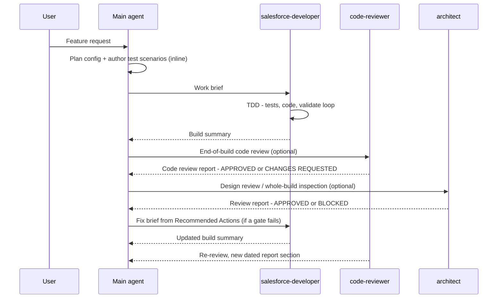

# sf-agentic-development

Salesforce skills and agents for AI agents, with the platform's rules built in. Point them at any
Apex, LWC, or Flow to catch what the platform punishes, or run the research→plan→build pipeline to
ship a new feature the way Salesforce expects.

## Contents

- [Why this exists](#why-this-exists)
- [What's Inside](#whats-inside)
- [Shipping a planned feature](#shipping-a-planned-feature)
- [Using the review skills](#using-the-review-skills)
- [Setup](#setup)
- [Skill Routing](#skill-routing)
- [Agent Orchestration](#agent-orchestration)
- [Roadmap](#roadmap)
- [Recommended companion skills](#recommended-companion-skills)
- [Maintaining](#maintaining)
- [License](#license)

## Why this exists

Generating Apex, LWC, and Flows is the easy part. Salesforce even ships
**[skills](https://github.com/forcedotcom/sf-skills)** for it. The hard part is everything around
it. Salesforce isn't traditional software development; it's metadata-driven, multitenant, and bound
by hard platform limits a generator can only enforce on code it writes itself — not on the Apex Class you
inherited or the Lightning Web Component someone built last year.

This repo covers the hard part: **`reviewing-*` skills** that hold any code to the platform's rules (governor limits, bulk safety,
FLS, trigger design), no matter who or what wrote it, plus a **research → plan → build** pipeline —
the **`researching-*` skills** that map the org's current state, **`sf-plan`** that turns that into a
verified design contract, and a build stage that ships it — making an agent reason like a Salesforce
developer before it writes a line.

The design follows a few principles:

- **Research, plan, implement.** Map the codebase and data schema, gather requirements first
  (the `researching-*` skills, one per domain → a reviewed `docs/<domain>.md`); then plan within the
  platform's architecture (`sf-plan`); then implement in the right layer: declarative setup (objects,
  fields, permissions) first, business logic in code. Each stage is human-gated — you review the
  research docs before planning and the design contract before building.
- **Context is expensive, and bad context poisons everything.** You can't load all of Salesforce's
  platform rules into the context window, so the knowledge is isolated into per-skill **reference
  packs** and pulled in only when a task needs it.
- **Skill invocation is probabilistic.** A skill's `description` won't reliably fire at the right
  moment, so the agent instruction file carries an explicit **skill-routing table** that maps
  context → skill deterministically.

---

## What's Inside

### Skills

**Research → Plan → Build** — the pipeline for a planned feature. Each research skill inventories one
domain's current state (scoped to the feature, not an org census) and writes a doc you review before
planning:

| Skill | Stage | Covers |
|---|---|---|
| `researching-data-model` | Research | Existing objects, fields, relationships, record types, volumes, config storage, org-wide settings → `docs/data-model.md` |
| `researching-automation` | Research | Automation already firing on the target objects (Flows, triggers, validation rules, roll-ups, async) and the framework new automation plugs into → `docs/automation.md` |
| `researching-integration-patterns` | Research | External systems, supported auth, existing Named/External Credentials, data format & limits, events → `docs/integration-patterns.md` |
| `researching-ui` | Research | Existing LWC/Flow/page surfaces & reusable components, placement, internal-vs-Experience-Cloud, design/accessibility constraints → `docs/ui-design.md` |
| `researching-security-model` | Research | OWD, sharing, permission sets vs profiles, FLS, record-level access, and the user/feature license inventory → `docs/security-model.md` |
| `sf-plan` | Plan | Turns the reviewed research docs into a verified, completeness-checked design contract — `docs/solution-design.md` + a lean `docs/CONTEXT.md` + one `docs/contracts/<slug>.md` per user story: grills decisions and makes the declarative-vs-code calls |
| `sf-build` | Build *(optional)* | Orchestrated build & review against the contract: dispatches the config skills and the `salesforce-developer` agent per work item, then runs the `reviewing-*` battery as a gate. Optional — the default build is the main agent working one story at a time; deploys stay human-gated |

**Review** — hold any code to the platform's rules, no matter who or what wrote it:

| Skill | Covers |
|---|---|
| `reviewing-apex` | Governor limits, trigger design, security, architecture, async, error handling, testing |
| `reviewing-lwc` | Component architecture, data sourcing, directives, async/events, performance, Jest |
| `reviewing-flow` | Entry-condition discipline, loop/collection/Transform optimization, fault handling and Custom Error, async paths, recursion, hardcoded IDs, complexity, flow tests, naming |

The apex/lwc/flow quality skills also bundle optional **domain reference packs** (B2B Commerce
today) — see [domain-specific reference packs](#domain-specific-reference-packs).

The five `researching-*` skills, `sf-plan`, and (optionally) `sf-build` drive the pipeline end to
end; see [Shipping a planned feature](#shipping-a-planned-feature).

### Agents

| Agent | Role |
|---|---|
| `salesforce-developer` | Receives a brief from the main agent; builds all automation — Apex (via TDD), LWC, Flows — in an isolated, parallelizable context; quality rules and project constraints come from the skills and brief; produces a build summary |
| `code-reviewer` | On-demand end-of-build **code-quality** review — runs the matching `reviewing-*` skills plus the analyzer over the delivered Apex/LWC/Flows and reports defects by severity; reviews only, never builds |
| `architect` | On-demand independent **solution-design** review — a pre-code design gate plus a dependency-scoped whole-build inspection against the design contract (completeness, scope, design conformance), reading the code-reviewer's report for code quality rather than re-running it; flags project-specific constraint violations (e.g. additive-only) only when the spec/brief/ADRs impose them; produces a gap-analysis report |

See [docs/ORCHESTRATION.md](docs/ORCHESTRATION.md) for the full workflow: the work-brief template, when to parallelize developer instances, and the review/fix loop.

### Agent Instruction File

`CLAUDE.md` at your project root is the instruction file Claude Code reads on every session. It does one job: route context to the right skill — research to the matching `researching-*` skill, authoring to each `generating-*` / config skill (which also self-trigger), and review to the right `reviewing-*` skill as an end-of-build pass. Everything else — safety rules, quality gates, domain knowledge (including the B2B Commerce packs) — lives in the skills themselves.

---

## Shipping a planned feature

For a *planned* feature — not an ad-hoc fix — the toolkit runs three human-gated stages:

- **Research** — run the `researching-*` skills for the domains the feature touches. Each inventories
  one slice of the org's current state — data model, automation, integrations, UI, security — scoped
  to the feature (not an org census) and writes a state-of-the-world `docs/<domain>.md` for you to
  review. This is where platform realities surface *before* design: a missing license, an object
  already populated so it can't take a master-detail, a sharing model that won't grant the access the
  feature needs.
- **Plan** — **`/sf-plan`** consumes those reviewed docs (it stops and routes you back to Research if
  one it needs is missing), then grills you to shared understanding one prose question at a time —
  with recommended choices, settling the overall solution shape before the per-capability
  declarative-vs-code calls — and writes a completeness-checked design contract: `docs/solution-design.md`
  (the design), a lean `docs/CONTEXT.md` (objective, user-story index, work-item dispatch table), and
  one `docs/contracts/<slug>.md` per user story. Run it again when requirements change and it
  **revises the spec in place**, grilling the change against the prior decisions instead of overwriting.
- **Build** — by default, work one story at a time: open its `docs/contracts/<slug>.md` (a fresh
  session per story keeps context lean) and build it with the authoring and review skills under
  [Skill Routing](#skill-routing). For a large multi-story build you can hand off to **`/sf-build`**
  instead — an **optional** orchestrated mode that dispatches the config skills and the
  `salesforce-developer` agent per work item, then runs the `reviewing-*` battery as a gate. Either
  way, deploys stay human-gated.

You review between every stage — the research docs before planning, the spec before building.
`/sf-plan` won't build, and `/sf-build` won't fire straight out of planning. This is the **planned**
path; for everything else — ad-hoc edits, fixes, reviews, audits, single config items — use the
skills under [Skill Routing](#skill-routing) directly.

### Example

First research the domains the feature touches. A merge that reparents Account children isn't just a
data-model question — the automation that fires when those children move, and the sharing that governs
who can see them after, both shape the design:

```text
/researching-data-model the Account child relationships and merge-related fields, for a dedupe console
```
```text
/researching-automation existing triggers, flows, and validation rules on Account and its reparented
children (Contacts, Opportunities, Cases) — what fires on reparent, and the recursion/order risk
```
```text
/researching-security-model OWD, sharing rules, and manual shares on Account and those child objects —
what access breaks or has to be recomputed when a child is reparented onto the surviving Account
```

Review the `docs/*.md` each research skill writes, then hand the lot to `/sf-plan`:

```text
/sf-plan I want a console where a user picks two duplicate Accounts, chooses which one
survives, reparents all the child records onto it, and retires the loser
```

`/sf-plan` reads the research docs rather than re-introspecting the org — the Account child
relationships from `docs/data-model.md`, the existing automation from `docs/automation.md`, who holds
Delete on Account from `docs/security-model.md` — then grills the open decisions one at a time, with a
recommendation for each. This is where the human input it can't deduce comes in:

- *Solution shape:* *"Reparent **synchronously** in the controller, or hand off to a **Queueable** when a hot account has thousands of children? I'd recommend an async path with a sync fast-path — agree?"* (the governor-limit fork)
- *"When the two Accounts disagree on a field — Phone, Owner, Rating — which wins: the survivor always, the most-recently-modified, or per-field resolution in the UI?"*
- *"What happens to the losing Account — hard delete, or deactivate and link it to the survivor for audit?"*
- *"Which child objects are in scope — Contacts, Opportunities, Cases, plus any custom children? And who may run a merge (it needs Delete on Account)?"*

Once you've agreed, it writes `docs/solution-design.md`, `docs/CONTEXT.md`, and a
`docs/contracts/<slug>.md` per story — the LWC console, the Apex controller and reparenting service
(async path), conflict-resolution rules, a permission set, and given/when/then scenarios. Because the
design carries async/bulk governor risk, it marks **Architect review: recommended** — the same gate
that, in another feature, caught a callout-per-record design before any Apex existed. You review the
spec, then build it story by story (or hand the whole spec to `/sf-build`).

**Grounding (no runtime dependency).** `/sf-plan` makes its declarative-vs-code calls from curated
decision packs bundled with the skill (`skills/sf-plan/references/`) — not from the model's memory,
and **not by fetching docs at runtime**, so the repo stays lightweight and ships no Playwright or
network dependency. The packs are kept current against official Salesforce documentation by the
maintainer and re-validated every release (see [docs/MAINTAINING.md](docs/MAINTAINING.md)). What's written here is
vetted, not guessed.

Full detail — the grilling pattern, the spec / work-item contract, why it replaces plan mode, and
how it feeds the agents — is in **[docs/PIPELINE.md](docs/PIPELINE.md)**.

---

## Using the review skills

Invoke a `reviewing-*` skill **by name** and point it at code you already have. Each is a complete
Salesforce reviewer — the same governor-limit, security, and architecture rules apply to an
inherited org as to a line you just wrote. No generation step required.

| Use it for | Example prompt |
|---|---|
| **Ad-hoc code review** — one class, a PR diff, a file you're about to change | `/reviewing-apex` review `OrderService.cls` for bulk safety and security |
| **Codebase quality audit** — assess the overall health of an existing or inherited org; great for onboarding or scoping tech debt | `/reviewing-apex` can you scan the codebase and assess the quality of the existing codebase |
| **Anti-pattern / performance sweep** — surface what's making automations slow and inefficient | `/reviewing-apex` can you scan the codebase and find anti-patterns that exist that make the automations slow and not efficient |
| **LWC review** — component performance, wire/async patterns, Jest gaps | `/reviewing-lwc` audit the components under `force-app/**/lwc/` for performance, wire/async issues, and Jest gaps |
| **Flow review** — loop/collection efficiency, fault paths, recursion | `/reviewing-flow` scan my flows for Get-Records-in-loop, missing fault paths, and recursion |

These review skills run as a **discrete pass** — on an explicit review request, or as the
end-of-build gate (the `code-reviewer` agent) once a feature is built; see
[Skill Routing](#skill-routing) below. They are not chained onto every generated file.

### Domain-specific reference packs

Some Salesforce work carries domain rules on top of the platform basics that a generic Apex, LWC, or
Flow review wouldn't know to check. Rather than ship a separate skill per domain, the three
`reviewing-*` skills carry that knowledge as **optional reference packs**: `references/<domain>.md`
files that load only when the artifact under review belongs to that domain. There's no extra skill
to invoke and no routing step; each pack rides its host skill's own trigger.

| Domain | Reference pack | Carried by |
|---|---|---|
| B2B Commerce (storefront) | `references/commerce-b2b.md` | `reviewing-apex` (backend), `reviewing-lwc` (storefront LWC), `reviewing-flow` (Commerce-object automation) |

B2B Commerce is the first such pack, and the only one today; more land here as their rules are vetted
and stabilized. Include a pack via the installer's prompt, or keep/delete its `references/*.md` files
manually — declining one strips only those files and leaves the base review rules untouched.

---

## Setup

### Install (interactive)

From the **root of your Salesforce project** (requires Node 18+):

```bash
npx github:drsaavedra/sf-agentic-development
```

The installer sets up Claude Code: it copies the skills and agents you pick into `.claude/` and
injects the routing into your project's `CLAUDE.md` as a managed block.

### After the installer

The installer does not install these for you — it only detects them and prints a reminder if
they're missing, leaving the install scope (project vs. user) your choice. Install the Salesforce
base skills (`generating-apex`, `generating-lwc-components`, `deploying-metadata`, `querying-soql`,
and more) yourself:

```bash
npx skills add forcedotcom/sf-skills
```

Nothing else to configure: the instruction file is skill routing only, and the `salesforce-developer`,
`code-reviewer`, and `architect` agents ask for the paths they need when you dispatch them.

<details>
<summary><strong>Manual setup (no installer)</strong></summary>

1. Copy the skills into your project:
   ```bash
   cp -r skills/* .claude/skills/
   ```
2. Copy the agents:
   ```bash
   cp -r agents/* .claude/agents/
   ```
3. Copy `CLAUDE.md` into your project root (or merge its contents into an existing `CLAUDE.md`).

4. Continue with [After the installer](#after-the-installer) above.

</details>

---

## Skill Routing

`CLAUDE.md` carries two explicit context→skill routing tables — **Authoring & Config Routing** and **Review Routing** — so the main agent routes from a compact index instead of relying on each skill's `description` being loaded. Each skill also self-triggers from its own `description` as a fallback. The full tables live in the instruction file; the summary below is representative.

**Authoring & Config** — match the context to its skill and invoke it before building:

| Context | Skill |
|---|---|
| Apex / Apex tests | `generating-apex` / `generating-apex-test` |
| Lightning Web Components | `generating-lwc-components` |
| SLDS styling (blueprints, hooks, utilities, icons) / compliance audit | `applying-slds` / `validating-slds` |
| Flows | `generating-flow` |
| Declarative metadata — objects, fields, tabs, apps, permission sets, FlexiPages, validation rules, list views | `generating-custom-object` and siblings |
| Ops — tests, logs, SOQL, data, integrations, analyzer, deploy | `running-apex-tests`, `debugging-apex-logs`, `querying-soql`, `handling-sf-data`, `building-sf-integrations`, `running-code-analyzer`, `deploying-metadata` |

> **TDD for Apex** — `generating-apex-test` (failing tests first) → `generating-apex` (minimum to pass).
> **SLDS pairing** — `applying-slds` doesn't auto-delegate from `generating-lwc-components`; pair them when building or restyling LWC UI.

**Review** — a separate end-of-build pass (not chained onto every edit): run the matching `reviewing-*` skill at the end of a build (typically via the `code-reviewer` agent), on an explicit review request, or as a quality gate. Cross-domain work loads both skills, in the order shown:

| Artifact under review | Skill(s) |
|---|---|
| Apex — classes / triggers / services / tests | `reviewing-apex` |
| LWC components | `reviewing-lwc` |
| Flows | `reviewing-flow` |

Domain rules (B2B Commerce today) ride inside the `reviewing-*` skills via optional `references/*.md` packs — no separate routing step. See [domain-specific reference packs](#domain-specific-reference-packs).

---

## Agent Orchestration

How the main agent and the three repo agents work together on a feature. This is most fully exercised
by the **optional** orchestrated build (`/sf-build`) — the heavier-token path you reach for on large
multi-story features; a default story-by-story build needs none of it, though you can still dispatch
the `code-reviewer` and `architect` on demand. The pattern is adapted from
[Agentic Project Management (APM)](https://github.com/sdi2200262/agentic-project-management):
self-contained task briefs, progress tracked through summaries rather than raw code, and
dependency-aware dispatch.

### The lifecycle



> **What the gates actually catch:** asked to add Account address verification via a vendor API, the
> `architect` reviewed the *design* before any code and blocked it — a synchronous callout per record
> blows the 100-callout limit on a 200-record load. Three flaws fixed before a line of Apex existed.

The full working guide — lifecycle steps, the work-brief template, dispatch rules, checkpoint
commits, and four worked examples — lives in **[docs/ORCHESTRATION.md](docs/ORCHESTRATION.md)**.

---

## Roadmap

This toolkit is a developer productivity tool today — you stay at the wheel. The direction is an
**autonomous delivery workflow**: agents that build, test, and deploy from a rigorous design
contract, escalating only at genuine gaps, with the human moving from *operator* to design
*author*. The capability gaps to get there, in build order (the first is the keystone that makes
autonomy safe to grant):

1. **Design contract + completeness gate** *(keystone)* — refuses to build an incomplete design.
2. **Autonomy + escalation model** — machine-gated safety conditions plus a "genuine gap" detector.
3. **Self-verifying build/deploy loop** — validate→correct→re-validate closes itself.
4. **Durable run state** — a persisted work-ledger so a long run survives context compaction.
5. **Environment ladder** — full autonomy through sandboxes; a human signature kept at production.

Full rationale and operating model in [docs/VISION.md](docs/VISION.md). Direction-setting, not a
commitment schedule — today's safety rules hold until each gate is built and proven.

---

## Recommended companion skills

This toolkit is deliberately Salesforce-only and takes no opinion on general coding-behavior
skills — they're optional. Two good options if you want one:

- **[andrej-karpathy-skills](https://github.com/multica-ai/andrej-karpathy-skills)** —
  behavioral guidelines that curb common LLM coding mistakes (overcomplication, sweeping
  changes, unstated assumptions). Install as a plugin:
    ```
    /plugin marketplace add forrestchang/andrej-karpathy-skills
    /plugin install andrej-karpathy-skills@karpathy-skills
    ```
- **[Superpowers](https://github.com/obra/superpowers)** — workflow skills for brainstorming,
  plan-writing, TDD, and systematic debugging. Install as a plugin:
    ```
    /plugin marketplace add obra/superpowers-marketplace
    /plugin install superpowers@superpowers-marketplace
    ```

Neither is wired into anything — if you install one, it activates on its own triggers
alongside the Salesforce skills.

---

## Maintaining

Maintaining this repo — editing `CLAUDE.md` and the skills, re-grounding the reference packs,
bumping the sf-skills pin, and the repository layout — is documented in **[docs/MAINTAINING.md](docs/MAINTAINING.md)**.

## License

[MIT](LICENSE)
