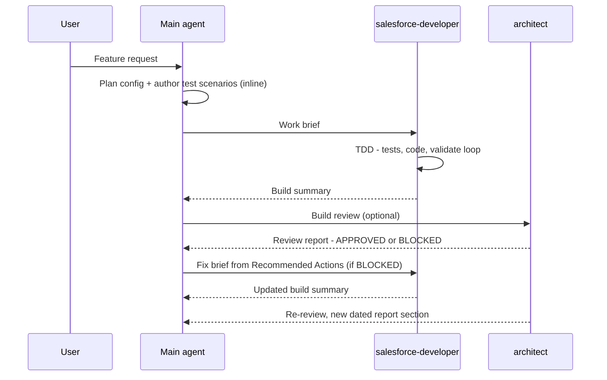

# sf-agentic-development

A developer productivity toolkit for **Claude Code**, **GitHub Copilot**, and **Codex** — skills and agents that keep you in the driver's seat while AI handles the heavy lifting.

The skills encode hard-won Salesforce quality rules — bulk safety, security, architecture patterns, anti-patterns — that fire automatically based on what you're building.

The agents provide on-demand specialisation. The main agent handles config planning and QA reasoning inline, since it already has your conversation context. The `salesforce-developer` agent runs automation work — Apex, LWC, Flows — in an isolated context, parallelizable across several instances at once. The `architect` agent gives you an independent technical review when you want one. How the three work together — the work brief, dispatch rules, and review loop — is covered in [docs/ORCHESTRATION.md](docs/ORCHESTRATION.md).

Agents are deliberately thin — the domain knowledge lives in the skills, which every agent shares. Project-specific constraints (e.g. additive-only, or reusing an existing logging framework) are passed in the work brief, not hardcoded into the agents.

This repo evolves continuously: new Salesforce releases, better agentic patterns, and improved practices get folded in over time. See [CHANGELOG.md](CHANGELOG.md) for what changed between pulls.

---

## What's Inside

### Skills (authored)

| Skill | Covers |
|---|---|
| `reviewing-apex` | Governor limits, trigger design, security, architecture, async, error handling, testing |
| `reviewing-lwc` | Component architecture, data sourcing, directives, async/events, performance, Jest |
| `reviewing-flow` | Entry-condition discipline, loop/collection/Transform optimization, fault handling and Custom Error, async paths, recursion, hardcoded IDs, complexity, flow tests, naming |
| `deploying-sf-metadata` | Deployment safety rules, `package.xml` / git-delta (sgd) generation, validate → quick-deploy, CI/CD patterns, and SFDMU data deployments |

The apex/lwc/flow quality skills also bundle an optional **B2B Commerce** reference pack
(`references/commerce-b2b.md`) — storefront Apex (`ConnectApi`/`CartExtension`), storefront LWC
(Storefront APIs, checkout adapters), and Commerce-object Flow automation. The installer includes
it only if you select it; each quality skill routes to it automatically when reviewing a Commerce
storefront artifact.

### Agents

| Agent | Role |
|---|---|
| `salesforce-developer` | Receives a brief from the main agent; builds all automation — Apex (via TDD), LWC, Flows — in an isolated, parallelizable context; quality rules and project constraints come from the skills and brief; produces a build summary |
| `architect` | On-demand independent review — pre-implementation, post-implementation, or both; flags project-specific constraint violations (e.g. additive-only) only when the spec/brief/ADRs impose them; produces a gap-analysis report |

See [docs/ORCHESTRATION.md](docs/ORCHESTRATION.md) for the full workflow: the work-brief template, when to parallelize developer instances, and the review/fix loop.

This toolkit ships **no baseline file** (`CLAUDE.md` / `AGENTS.md` / `copilot-instructions.md`). Each skill and agent is self-contained: skills declare their own triggers and carry their own safety rules, and the agents ask for spec/architecture paths at dispatch time. Nothing is forced into a consumer's repo root.

---

## Setup

### Install (interactive)

From the **root of your Salesforce project** (requires Node 18+):

```bash
npx github:drsaavedra/sf-agentic-development
```

The installer asks which assistant you use (Claude Code / GitHub Copilot / Codex, arrow keys to
pick), then which skills, which optional domain reference packs (e.g. **B2B Commerce** — included
only if you check it, and only offered when a selected skill carries that pack), and which agents
to install (spacebar to toggle checkboxes, `a` to select all, Enter to confirm) — then copies your
picks into the right per-assistant directories. It writes no baseline file: the skills and agents
are self-contained.

It then checks whether the toolkit's one dependency — `forcedotcom/sf-skills`, the
Salesforce-maintained base skills that do the generation this repo's quality gates sit on top
of — is already installed (project and user-level skill directories), and offers to run
`npx skills add` for it if it's missing. Behavioral-guideline skills are your choice, not a
dependency — see [Recommended companion skills](#recommended-companion-skills).

### After the installer

This step is only needed if you declined the installer's offer (or it couldn't detect an
existing install):

1. Install the Salesforce-maintained base skills — 50+ official skills (`generating-apex`,
   `generating-lwc-components`, `deploying-metadata`, `querying-soql`, and more):
   ```bash
   npx skills add forcedotcom/sf-skills
   ```

There's nothing else to configure: the `salesforce-developer` and `architect` agents ask for
your technical-spec and architecture document paths when you dispatch them.

### B2B Commerce projects

There is no separate B2B Commerce skill. The B2B Commerce Domain rules are folded into the three quality
skills as `references/commerce-b2b.md` — Apex backend rules under `reviewing-apex`,
storefront LWC rules under `reviewing-lwc`, and Commerce-object automation rules under
`reviewing-flow`. Each skill's routing table points at its `commerce-b2b.md` when the
artifact under review is a B2B Commerce storefront artifact, so the Commerce review pass rides the
quality skill's own trigger — no manual invoke.

The installer asks whether to include the **B2B Commerce** pack. Decline it and the
`commerce-b2b.md` files and their routing rows are stripped from the installed skills (the base
review rules are untouched). For a manual copy, just keep or delete `references/commerce-b2b.md`
in each skill.

### Repository layout

```
skills/<name>/              ← 4 authored Salesforce skills (canonical source: SKILL.md + references/)
agents/<name>.md            ← 2 Salesforce agents (canonical source)
scripts/install.js          ← the interactive installer (npx entry point)
```

| Assistant | Reads SKILL.md from |
|---|---|
| Claude Code | `.claude/skills/<name>/SKILL.md` |
| Copilot (VS Code) | `.claude/skills/`, `.github/skills/`, or `.agents/skills/` — any one |
| Codex | `.agents/skills/<name>/SKILL.md` |

All three use the same `name` + `description` frontmatter format.

<details>
<summary><strong>Manual setup (no installer)</strong></summary>

1. Copy the skills into the assistant-specific directory of your project:
   ```bash
   cp -r skills/* .claude/skills/    # Claude Code (Copilot also reads this)
   cp -r skills/* .github/skills/    # GitHub Copilot
   cp -r skills/* .agents/skills/    # Codex
   ```
2. Copy the agents:
   ```bash
   cp -r agents/* .claude/agents/    # Claude Code
   cp -r agents/* .github/agents/    # GitHub Copilot
   cp -r agents/* .agents/agents/    # Codex
   ```
3. Continue with [After the installer](#after-the-installer) above. There's no baseline file to
   copy — the skills and agents are self-contained.

</details>

---

## Skill Routing

Each skill declares its own trigger in its `description` frontmatter, so the assistant invokes it automatically based on context — there's no baseline routing table. The table below summarizes which skills cover which context. Cross-domain work (LWC + Apex controller, Flow + invocable Apex) loads both relevant skills, and each quality skill names its own cross-domain partner:

| Context | Skills |
|---|---|
| Apex classes / triggers / services | `generating-apex` · `reviewing-apex` |
| Apex test classes | `generating-apex-test` · `reviewing-apex` |
| LWC components | `generating-lwc-components` · `reviewing-lwc` |
| LWC + Apex controller | `reviewing-lwc` · `reviewing-apex` |
| Flows | `generating-flow` · `reviewing-flow` |
| Flow + Apex invocable | `reviewing-flow` · `reviewing-apex` |
| Deployment / package.xml / CI-CD | `deploying-sf-metadata` · `deploying-metadata` |
| B2B Commerce storefront *(optional pack)* | The matching quality skill reads its `references/commerce-b2b.md` — Apex (`reviewing-apex`), LWC (`reviewing-lwc`), Flow (`reviewing-flow`) |

---

## Agent Orchestration

How the main agent and the two repo agents work together on a feature. The pattern is adapted
from [Agentic Project Management (APM)](https://github.com/sdi2200262/agentic-project-management):
self-contained task briefs, progress tracked through summaries rather than raw code, and
dependency-aware dispatch. Three APM mechanisms were deliberately **not** adopted — the file-based
message bus and handoff procedures (Claude Code / Copilot / Codex subagents pass context natively
via prompt and result), and the separate Planner agent (the main agent plans inline because it
already holds your conversation context).

### The lifecycle



The full working guide — the lifecycle steps, the work-brief template, dispatch rules, checkpoint
commits, prompting guidance, and four worked examples — lives in
**[docs/ORCHESTRATION.md](docs/ORCHESTRATION.md)**.

---

## Roadmap

This toolkit is a developer productivity tool today — you stay at the wheel. The direction it's
heading is an **autonomous delivery workflow**: agents that build, test, and deploy Salesforce
solutions from a rigorous design contract, escalating only at genuine gaps. The human's role moves
from *operator* (approving each command) to *author* (curating the design the workflow executes).
The full rationale and target operating model live in [docs/VISION.md](docs/VISION.md).

The capability gaps between today's tool and that target, in build order — the first is the
keystone that makes autonomy safe to grant:

1. **Design contract + completeness gate** *(keystone)* — a machine-checkable CONTEXT/spec schema
   and a gate that refuses to build an incomplete design. Makes autonomy safe to grant.
2. **Autonomy + escalation model** — convert today's human-confirmation safety gates to
   machine-gated conditions, plus a concrete "genuine gap" detector and the autonomy boundaries
   (what never gets delegated).
3. **Self-verifying build/deploy loop** — the validate→correct→re-validate loop closes itself:
   retry budget, machine-checkable "done," automatic BLOCKED→fix routing.
4. **Durable run state** — a persisted work-ledger (done / blocked / deployed-where) so a long run
   survives context compaction and is auditable, instead of living only in chat context.
5. **Environment ladder** — total autonomy through scratch orgs and CI sandboxes; a human
   signature kept at production.

> Direction-setting, not a commitment schedule. Today's human-at-the-wheel safety rules stay in
> force until each gate above is built and proven.

---

## Recommended companion skills

This toolkit is deliberately Salesforce-only: `forcedotcom/sf-skills` does the base generation
(maintained by Salesforce), and the authored `salesforce-*` skills add the quality gates. It
takes no opinion on general coding-behavior skills — those are a personal preference, so the
toolkit requires none. If you want one, two good options:

- **[andrej-karpathy-skills](https://github.com/forrestchang/andrej-karpathy-skills)** —
  behavioral guidelines that curb common LLM coding mistakes (overcomplication, sweeping
  changes, unstated assumptions). Install as a plugin:
    ```
    /plugin marketplace add forrestchang/andrej-karpathy-skills
    /plugin install andrej-karpathy-skills@karpathy-skills
    ```
- **[Superpowers](https://github.com/obra/superpowers)** — workflow skills for brainstorming,
  plan-writing, TDD, and systematic debugging. Install as a plugin:
    ```
    /plugin marketplace add obra/superpowers-marketplace
    /plugin install superpowers@superpowers-marketplace
    ```

Neither is wired into anything — if you install one, it activates on its own triggers
alongside the Salesforce skills.

---

## Maintaining

- **Skills & agents** — `skills/` and `agents/` are the only source of truth. Edit `skills/<name>/` (the `SKILL.md` and its `references/`) or `agents/<name>.md`, then re-run the installer (or re-copy) into the per-assistant directories. Never edit the installed copies — changes are lost on the next install.

## License

[MIT](LICENSE)
