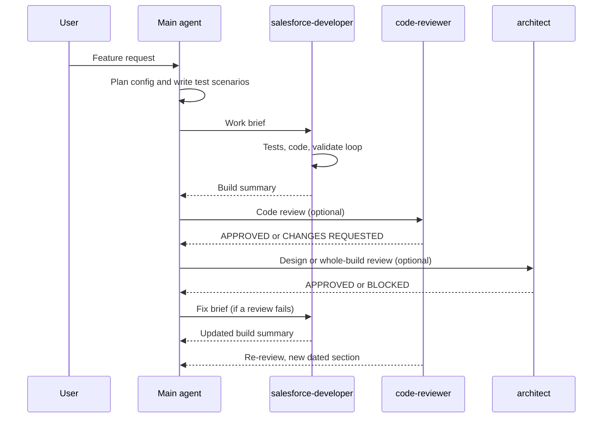

# sf-agentic-development

Claude Code skills, agents and rules for Salesforce work. Point a review skill at any Apex, LWC or
Flow to find what breaks at volume, for a non-admin user, or after deploy. For a new feature, run
research, plan and build, in that order.

## Why this exists

Claude already writes Apex, LWC and Flows well. What it gets wrong are the platform's rules:
governor limits, bulk safety, FLS and sharing, trigger order, packaging. Those rules apply just as
much to the class you inherited as to code Claude writes today, so the checks here run against any
code, whoever wrote it.

Four choices shape the repo:

- **Research, then plan, then build.** Each stage writes files you review before the next starts.
- **Load knowledge only when the task needs it.** Platform rules sit in per-skill reference packs,
  so a Flow review never loads the LWC rules.
- **Route explicitly.** A skill's description does not fire reliably, so the rules files map each
  kind of work to its skill.
- **Prove it, don't claim it.** A test counts only if deleting the code it covers makes it fail. A
  deploy counts only when the code is read back from the org.

## What's inside

### Skills

| Skill | Use it to |
|---|---|
| `sf-research` | Inventory the org for the domains your prompt names (data model, security, automation, UI, integration) and write one `docs/<domain>.md` each for you to review. |
| `sf-plan` | Turn the reviewed research into a design contract: `docs/solution-design.md`, `docs/CONTEXT.md` and one `docs/contracts/<slug>.md` per story. It asks you the open decisions one at a time. |
| `sf-build` | Optional. Build a large multi-story contract by dispatching the developer agent per work item, then run the review skills as a gate. |
| `reviewing-apex` | Review Apex for governor limits, trigger design, security, async, error handling and test quality. |
| `reviewing-lwc` | Review LWC for data sourcing, template and DOM traps, events and errors, performance and Jest. |
| `reviewing-flow` | Review Flows for entry conditions, loops and collections, fault paths, recursion and hardcoded IDs. |
| `generating-b2b-lwc` | Write B2B/B2C Commerce storefront LWC for an LWR store. `reviewing-lwc` reviews the result. |

### Agents

| Agent | Role |
|---|---|
| `salesforce-developer` | Builds Apex (test first), LWC and Flows from a work brief in its own context. It validates only what changed, makes each test fail once on purpose, and reads deployed code back before trusting it. |
| `code-reviewer` | Runs the review skills and the Code Analyzer over a finished build. It reports only on what the change touched and parks older defects separately. |
| `architect` | Reviews a design before any code, and checks a finished build against the design contract. |

### Rules

`CLAUDE.md` is a short pointer to four rule files that install into `.claude/rules/sf-agentic-development/`:

| File | Covers |
|---|---|
| `pipeline.md` | The research, plan and build stages, and which research doc each domain writes |
| `authoring.md` | How Claude writes Apex, LWC, Flows and metadata: test first, validate as the gate, real API names, current docs |
| `review-routing.md` | Which review skill runs on which file. Loads only when a Salesforce file is opened |
| `safety.md` | Deploys, git and secrets |

## What runs without asking

| Runs on its own | Asks you first |
|---|---|
| Validates, tests, the Code Analyzer and read-only org queries | A deploy to a sandbox, production, or any org that is not a scratch org |
| A deploy to a scratch org (`isScratch: true` in `sf org list --json`), followed by a report of the alias, deploy ID and components | A destructive deploy, or a deploy to a scratch org someone else is using |
| | Any git commit, unless you grant checkpoint commits, and every push |

Only the main agent deploys. The full rule is `[no-deploy-without-approval]` in `rules/safety.md`.

## Shipping a planned feature

1. **Research.** Run `/sf-research` and name the domains the feature touches. It writes a
   `docs/<domain>.md` per domain. This is where the blockers surface before design: a missing
   licence, a populated object that cannot take a master-detail, a sharing model that will not grant
   the access.
2. **Plan.** Run `/sf-plan` with the objective. It reads the research docs, asks you the open
   decisions one at a time with a recommendation each, and writes the design contract.
3. **Build.** Build one story at a time from its `docs/contracts/<slug>.md`, or hand a large contract
   to `/sf-build`.

You review between every stage. `/sf-plan` never starts the build. For ad-hoc fixes, reviews and
single config changes, skip the pipeline and use the skills directly.

### Example

A merge console that moves Account children onto a surviving Account touches the data model,
automation and sharing, so name all three:

```text
/sf-research I want a console where a user picks two duplicate Accounts, chooses which one survives,
reparents all the child records onto it, and retires the loser. Map Account's child relationships and
their volumes, the OWD and sharing design, and the automation on Account and its children that fires
on reparenting.
```

Review the three docs it writes, then plan:

```text
/sf-plan I want a console where a user picks two duplicate Accounts, chooses which one
survives, reparents all the child records onto it, and retires the loser
```

`/sf-plan` asks what it cannot work out from the docs, for example:

- *"Reparent in the controller, or hand off to a Queueable when an Account has thousands of
  children? I'd recommend async with a synchronous fast path."*
- *"What happens to the losing Account: delete it, or deactivate it and link it to the survivor?"*

It then writes the contract: the LWC console, the Apex service, the conflict rules, a permission
set and given/when/then test scenarios. The decision packs it uses ship with the skill and are
checked against Salesforce's documentation each release, so planning needs no network access.

More detail: [docs/PIPELINE.md](docs/PIPELINE.md).

## Reviewing code you already have

Call a review skill by name and point it at existing code:

| Use it for | Example prompt |
|---|---|
| One class or a PR diff | `/reviewing-apex review OrderService.cls for bulk safety and security` |
| An inherited codebase | `/reviewing-apex assess the quality of the Apex in force-app` |
| Slow automation | `/reviewing-apex find the patterns that make our triggers slow` |
| Components | `/reviewing-lwc audit force-app/**/lwc for wire and async issues and Jest gaps` |
| Flows | `/reviewing-flow find Get Records in loops, missing fault paths and recursion` |

Reviews run as a separate pass, on request or at the end of a build, not after every edit.

Some domains need rules a general review would not know. Those ship as optional packs inside the
review skills and load only when the code belongs to that domain. B2B Commerce
(`references/commerce-b2b.md` in all three) is the only one today. The installer asks whether to
include it.

## Setup

From the root of your Salesforce project (Node 18 or later):

```bash
npx github:drsaavedra/sf-agentic-development
```

The installer copies the skills and agents you pick into `.claude/`, the rules into
`.claude/rules/sf-agentic-development/` (its own folder, so your own rule files are never touched), and adds the `CLAUDE.md` pointer to your project's `CLAUDE.md` as a managed block.
Nothing else needs installing.

Optional: copy [`templates/code-analyzer.yml`](templates/code-analyzer.yml) to your project root.
It raises the security rules the review skills treat as blocking, so `sf code-analyzer run`
enforces them on every change, including quick fixes that never get a full review.

<details>
<summary><strong>Manual setup (no installer)</strong></summary>

1. Copy the skills: `cp -r skills/* .claude/skills/`
2. Copy the agents: `cp -r agents/* .claude/agents/`
3. Copy the rules: `mkdir -p .claude/rules/sf-agentic-development && cp rules/*.md .claude/rules/sf-agentic-development/`
4. Copy `CLAUDE.md` to your project root, or merge it into the one you have.

</details>

## How the agents work together

The main agent plans and writes the briefs. The developer builds, and the reviewers check on
request. You reach for this on a large build through `/sf-build`; a story-by-story build only needs
the review agents when you want them. The pattern comes from
[Agentic Project Management](https://github.com/sdi2200262/agentic-project-management):
self-contained briefs, progress tracked through summaries, dispatch in dependency order.


```mermaid
sequenceDiagram
    participant U as User
    participant M as Main agent
    participant D as salesforce-developer
    participant R as code-reviewer
    participant A as architect
    U->>M: Feature request
    M->>M: Plan config and write test scenarios
    M->>D: Work brief
    D->>D: Tests, code, validate loop
    D-->>M: Build summary
    M->>R: Code review (optional)
    R-->>M: APPROVED or CHANGES REQUESTED
    M->>A: Design or whole-build review (optional)
    A-->>M: APPROVED or BLOCKED
    M->>D: Fix brief (if a review fails)
    D-->>M: Updated build summary
    R-->>M: Re-review, new dated section
```

One example of what the reviews catch: asked to add address verification against a vendor API, the
`architect` blocked the design before any Apex existed, because a callout per record breaks the
100-callout limit on a 200-record load.

The work-brief template, dispatch rules, checkpoint commits and four worked examples are in
[docs/ORCHESTRATION.md](docs/ORCHESTRATION.md).

## Roadmap

The aim is delivery that runs from a rigorous design contract with a person signing off only where
it matters. The gaps, in build order:

1. **Design contract with a completeness gate.** `sf-plan` has a self-review gate today; the next
   step is a contract a machine can check.
2. **Autonomy with escalation.** Turn the remaining confirmations into checked conditions, and stop
   only at a real gap.
3. **A build loop that verifies itself.** Validate, fix and revalidate with a retry budget.
4. **Durable run state,** so a long run survives a context reset.
5. **An environment ladder.** Scratch-org deploys already run without asking. Sandboxes come next.
   Production always keeps a person's sign-off.
6. **A tester agent that checks the work through the UI.** Validates and unit tests prove the code,
   not that a user can actually do the thing. A `tester` agent drives the org in Chrome and walks
   each acceptance criterion the way a user would. It finds its way from a feature map you keep in
   the repo: one feature file per feature, saying where the feature lives, how a user gets there and
   what a pass looks like.

Rationale: [docs/VISION.md](docs/VISION.md).

## Maintaining

Editing the skills and rules, re-checking the reference packs against Salesforce's docs, and the
repo layout are covered in [docs/MAINTAINING.md](docs/MAINTAINING.md).

## License

[MIT](LICENSE)
