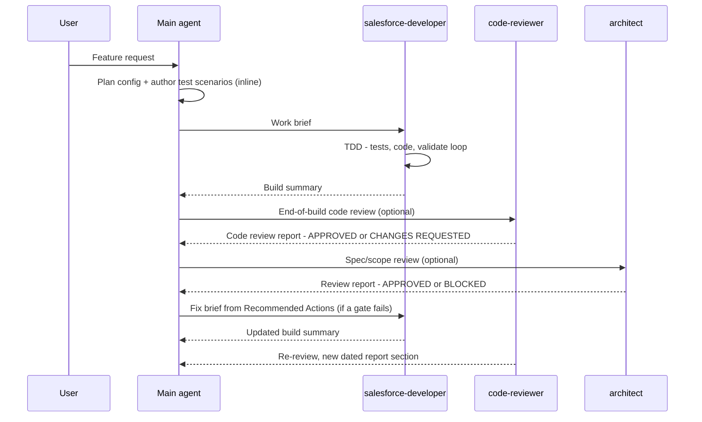

# Agent Orchestration

> The summary and lifecycle diagram live in the [README](../README.md#agent-orchestration);
> this is the full working guide — the lifecycle steps, the work-brief template, dispatch rules,
> checkpoint commits, prompting guidance, and four worked examples.

How the main agent and the three repo agents work together on a feature. The pattern is adapted
from [Agentic Project Management (APM)](https://github.com/sdi2200262/agentic-project-management):
self-contained task briefs, progress tracked through summaries rather than raw code, and
dependency-aware dispatch. Three APM mechanisms were deliberately **not** adopted — the file-based
message bus and handoff procedures (Claude Code / Copilot / Codex subagents pass context natively
via prompt and result), and the separate Planner agent (the main agent plans inline because it
already holds your conversation context). Only the ideas are borrowed — none of APM's files are
copied or derived (APM is licensed MPL-2.0; this toolkit is MIT).



## The lifecycle

1. **Plan inline** — the main agent designs the config (objects, fields, access) and authors the
   QA/test scenarios in conversation with you. No planner agent — the main agent already has the
   context.
2. **Compose a work brief** — one brief per unit of dev work, using the template below.
3. **Dispatch `salesforce-developer`** — one instance, or several in parallel (dispatch rules below).
4. **Developer builds** — Apex via TDD (tests first, minimum implementation, validate-deploy
   loop until green); LWC and Flow briefs author and validate against their scenarios — then
   writes the **build summary** (default `docs/dev-build-summary.md`). The `reviewing-*` quality
   pass is **not** chained into this loop; it runs once, after the build, as a discrete gate (step 6).
5. **Main agent reads the build summary, not the raw code** — the summary is the integration
   point: it tells the main agent what exists, which scenarios passed, and what the next brief can
   depend on.
6. **Invoke a review gate when you want one** — two complementary, on-demand gates, never mandatory:
   - **`code-reviewer`** — the end-of-build **code-quality** pass: runs the matching `reviewing-*`
     skills plus the analyzer over the delivered artifacts and reports defects by severity.
   - **`architect`** — the **spec/scope** gate: design review before coding, build review after, or
     both; validates completeness and scope against the design contract.
   Dispatch either, both, or neither — code quality and spec completeness are orthogonal checks.
7. **Fix loop** — a failing review (**CHANGES REQUESTED** from `code-reviewer`, or **BLOCKED** from
   `architect`) goes back to `salesforce-developer` as a new brief built from the report's
   Recommended Actions; the same gate re-reviews after the fix and appends a new dated section to
   its report (the reports are append-only history).
8. **You gate the irreversible steps** — validates and deploys are confirmed per the deployment
   skill's safety rules, and you can review any brief or report before the next agent acts on it.

## The work brief

The brief is what makes the developer agent effective in an isolated context: it must be
**self-contained**. Schema and spec content the task needs is embedded in the brief — a bare
path reference forces the agent to rediscover context it can't see from your conversation.

```markdown
## Work Brief — <task name>

**Objective** — <what to build, one paragraph>
**Spec reference** — <path + relevant sections>
**Schema context** — <objects, fields, relationships this code touches — embedded, not just referenced>
**Test scenarios** — <concrete cases: given / when / then>
**Constraints** — <project-specific rules, e.g. additive-only, reuse the existing logging framework — or "none">
**Dependencies** — <outputs of prior tasks this builds on: file paths, method signatures, integration guidance — or "none">
**Expected outputs** — <classes / triggers to produce + the build summary>
**Validation criteria** — <all scenarios green, ≥85% coverage per class, analyzer clean>
```

| Field | What goes in it |
|---|---|
| Objective | The unit of work in plain language — what exists when this brief is done |
| Spec reference | Path to the design contract that applies to this task — for the `/sf-plan` pipeline, the story's `docs/contracts/<slug>.md` (with the work item `§N` within it); for other projects, the spec/HLD path plus sections |
| Schema context | The data model the code touches, written out in the brief. The developer runs isolated — don't make it rediscover the schema. Gather it verified, not guessed: `sf sobject describe` and read-only queries against the org (the developer agent's "Org introspection & schema truth" rule) |
| Test scenarios | The TDD requirements. The developer writes these as failing tests first, so they must be concrete enough to assert on |
| Constraints | Project-specific rules from the spec or your conversation. Constraints live in the brief, never hardcoded in the agent |
| Dependencies | What earlier briefs produced that this one consumes — paths, signatures, and how to integrate |
| Expected outputs | The artifact list, so "done" is checkable |
| Validation criteria | The exit condition the developer loops against before reporting back |

When the context a task needs lives in scattered org config rather than the spec — queues,
record types, business-hours rules — gather it into the brief too: the isolated agent can't see
your conversation, and a bare "see the spec and the org" reference spends its run rediscovering
(or worse, inventing) exactly that context.

If a brief lacks test scenarios or validation criteria, the developer agent asks instead of
inventing requirements — write them before dispatching.

## Dispatch rules — whether to dispatch, then parallel or sequential?

**The dispatch threshold — orchestrate only when complexity pays for it.** A spawned agent
starts cold: it re-reads project context the main agent already holds, and that costs real
tokens — spending them is your call, so when the case is marginal the main agent should surface
the trade-off rather than silently spawn. The counterweight is your main context window:
long-running or complex work done inline fills it fast, and a crowded context degrades
everything that follows. That tension is the decision map:

- **Stays with the main agent** — simple, single-artifact work (one class, one small fix, any
  config): the brief plus the cold start cost more tokens than they save, and the main agent
  already holds the context.
- **Dispatch to `salesforce-developer`** — work heavy enough to crowd the main conversation:
  independent or contract-pinned items that build in parallel, a multi-artifact chain with a
  long TDD/validate loop, or a build you want to keep planning around while it runs.
- **Review gates are orthogonal** — both `code-reviewer` and `architect` are on-demand at any
  size; review cost scales with the artifact, not the dispatch shape.

Once dispatching, parallel or sequential:

- **Independent work items** (separate objects or domains, no shared classes) → **parallel**
  developer instances, one brief each.
- **Dependent chain** (a service class consumed by a trigger handler) → **one** instance, the
  chain sequenced inside a single brief. The agent that built the producer already knows it —
  don't split the chain across instances.
- **Unavoidable cross-instance dependency** → the consuming brief embeds a comprehensive summary
  of the producer's output (file paths, method signatures, integration guidance) taken from the
  producer's build summary — or, when dispatching both sides in parallel before either exists,
  the **contract** (method signatures, public APIs, schema) pinned by the main agent up front
  and embedded in both briefs. Integration is then verified with one combined validate at the
  merge point.

## Checkpoint commits (opt-in)

The git safety rule (never commit without an explicit grant — see **Deployment & git safety** in
the baseline, `CLAUDE.md` / `AGENTS.md` / `.github/copilot-instructions.md`) means a long
multi-brief run normally accumulates everything in the working tree — if work item four goes
sideways, there is no stable point to roll back to, and a handover has no commit to point at.
**Checkpoint mode** trades a single explicit grant for rollback safety and a referenceable history,
the same shape as the TDD validate-loop exception (confirm once, then iterate automatically):

1. **Grant** — enable it one of two explicit ways: (a) **at planning time**, by answering
   `sf-plan`'s checkpoint question, which records `Checkpoint commits: enabled` in `docs/CONTEXT.md`
   — `/sf-build` reads that flag and honors it with a one-time announcement; or (b) **in the prompt**
   for one task: *"checkpoint as you go"*, *"enable checkpoint commits"*, or any equally explicit
   wording (you can narrow it, e.g. *"only checkpoint completed work items, not every validate"*).
   What never activates it: plan approval alone (approving the plan ≠ answering the checkpoint
   question), or the agent inferring it because the run is long — the agent never turns checkpoint
   mode on by itself. The grant is scoped to the task / the build of that spec; a new task or a spec
   revision needs a fresh grant.
2. **Branch** — depends on what the commit is for:
   - **Durable review-gated milestones** (see *Stable points*) land on the **current working
     branch** — they record work that passed review and are referenced by hash in handover, so they
     belong in real history, not a throwaway branch.
   - **Throwaway rollback checkpoints** (green validate, pre-risky-step) may instead go on a
     dedicated `checkpoint/<task-slug>` branch created from HEAD, leaving your working branch clean.

   If the working tree is dirty at grant time, the agent asks once whether to record a
   `checkpoint: baseline (pre-task state)` commit first.
3. **Stable points** — commits happen only at: **a review gate passed clean** (the `reviewing-*`
   battery is clean for a work item or dependent chain, or the `architect` returned APPROVED), a
   green validate, a completed work item (the commit includes its build summary), or immediately
   before a risky/hard-to-undo step. Messages follow `checkpoint: <work item> — <state>` (e.g.
   `checkpoint: account-rollups §1 open-case rollup — review passed`). Only the main agent commits —
   developer, code-reviewer, and architect agents never run git — and parallel dispatches checkpoint
   only at merge points, so a commit never captures another instance's partial work.
4. **Record the hash for handover** — after a review-gated milestone commit, capture the short hash
   (`git rev-parse --short HEAD`) and record it in the story's `docs/contracts/<slug>.md` **Build
   log** and the **Commit** column of that row in the `docs/CONTEXT.md` dispatch table. The hash
   isn't known until after the commit, so these doc edits ride along in the **next** milestone
   commit, and a final **wrap-up commit** flushes the last row's notes — never `--amend`.
5. **Wrap-up** — at task end the agent reports the branch and the checkpoint list (work item → short
   hash). Rolling back to a checkpoint, merging or squashing into your branch, pushing, and deleting
   any `checkpoint/<task-slug>` branch all remain explicit requests from you.

The full rule lives in the baseline's **Deployment & git safety** section.

## Prompting a pattern

You never have to name a pattern. Describe the build, and the main agent derives the dispatch
shape from the dependency structure of the work: dependent chain → one instance, independent
items → parallel, review only when you ask for it. The work brief happens regardless — it's
how every dispatch is packaged.

You steer with three levers: **how you scope the work** (one feature vs. several independent
pieces), **whether you ask for parallelism or contract pinning**, and **whether you request an
architect gate** (it is on-demand, never automatic). Example prompts:

| Pattern | What you'd type |
|---|---|
| 1 — Dependent chain + fix loop | *"Implement the open-case rollup from spec §4.2 — send it to the developer agent, then have the architect review the build."* |
| 2 — Contract-first parallel dispatch | *"Build a reusable datatable LWC driven by custom metadata, plus versions for Account, Contact, and Opportunity. Pin the contracts first and run the dev work in parallel where the pieces allow it."* |
| 3 — Review gates at both ends | *"We need address verification on Accounts against the vendor API. Have the architect clear the design before any code is written, and review the build afterwards."* |
| 4 — Cross-domain chain (Flow + invocable Apex) | *"Add round-robin assignment for new leads: a record-triggered flow on Lead create that hands the batch to an invocable Apex action, rotating evenly across the Sales queue's members."* |

The italicized phrases are the levers: *"in parallel where the pieces allow it"*, *"pin the
contracts first"*, *"before any code is
written"*, *"checkpoint as you go"*. Leave them out and the main agent still picks a sane shape — sequential, briefed,
no review — and you can redirect at any checkpoint. Each worked example below opens with its
kickoff prompt.

## Worked examples

Standard-object scenarios, one per orchestration pattern — each based on a build the Salesforce
community demonstrably does a lot (sources linked inside). All collapsed — expand the one that
matches the situation you're in.

| # | Pattern | Scenario |
|---|---|---|
| 1 | Dependent chain + fix loop | Open-case rollup to Account (the rollup a formula can't do) |
| 2 | Contract-first parallel dispatch | Apex controller ‖ LWC built in parallel: a reusable CMDT-driven datatable |
| 3 | Review gates at both ends | Account address verification via Named Credential callout |
| 4 | Cross-domain chain: Flow + invocable Apex | Round-robin lead assignment — record-triggered flow calling an invocable action |

<details>
<summary><strong>Example 1 — dependent chain + fix loop: open-case rollup to Account (single instance)</strong></summary>

**The kickoff prompt** — *"Implement the open-case rollup from spec §4.2 — send it to
the developer agent, then have the architect review the build."* The service and the trigger
that calls it are a dependent chain, so the main agent sends both to one instance in one brief.

**Why this rollup needs Apex at all** — the first thing the main agent checks before any code
is briefed. Case↔Account is a plain lookup with no declarative rollup path: Roll-Up Summary
fields need master-detail, and the standard-relationship exception covers Opportunity→Account
and CampaignMember→Campaign — **not** Case. A record-triggered flow can't fire on undelete,
which the count must survive. When the platform gives the rollup away — summing won Opportunity
Amount onto Account is a five-minute Roll-Up Summary field, no code — take the field, not the
trigger; briefing Apex for that burns a developer instance on config work.

**The brief** (composed by the main agent after planning the config inline):

```markdown
## Work Brief — Open-case rollup to Account

**Objective** — Maintain Account.Open_Case_Count__c as the count of the account's open Cases,
updated on case insert, update (status change or reparent), delete, undelete.
**Spec reference** — docs/contracts/account-rollups.md §1 "Open-case rollup"
**Schema context** — Case.AccountId (lookup — no Roll-Up Summary possible on it, and flows
can't trigger on undelete: hence Apex). Account.Open_Case_Count__c: Number(8,0), already
deployed. Open = IsClosed = false.
**Test scenarios**
- Insert 200 open cases across 50 accounts → each account counts its own cases (bulk)
- Close a case → count decreases; reopen it → count increases
- Reparent an open case to another account → old account decreases, new account increases
- Delete / undelete an open case → count follows
- Case with no AccountId → ignored, no exception
**Constraints** — Reuse the existing TriggerHandler base class (force-app/main/default/classes/TriggerHandler.cls); additive-only.
**Dependencies** — none
**Expected outputs** — CaseTrigger (extended), CaseRollupService.cls,
CaseRollupServiceTest.cls + build summary entry
**Validation criteria** — all scenarios green via validate deploy, ≥85% coverage, analyzer clean
```

**The build** — the developer writes `CaseRollupServiceTest` first (fails), implements
`CaseRollupService`, loops `sf project deploy validate --test-level RunSpecifiedTests`
until green, and appends to `docs/dev-build-summary.md`:

> **CaseRollupService** — maintains the open-case count per Account (spec §4.2).
> Scenarios: bulk insert, close/reopen, reparent, delete/undelete, orphan case.
> Tests: 6/6 pass · coverage 94%.

**The review** — you invoke `architect` for a build review. It reads the spec and the build
summary, runs the code analyzer, and appends to `docs/sa-review-report.md`:

> ## Review — Open-case rollup (2026-06-12)
> ### Review Status: BLOCKED
> #### Gaps — Reparenting recalculates the new account but not the prior account when
> AccountId and Status change in the same update (spec §4.2: "both accounts must be
> recalculated"). Test scenario 3 passes only for the single-field update path.
> #### Out of Scope — None
> #### Recommended Actions — 1. Collect old and new AccountId into the recalc set when either
> Status or AccountId changes. 2. Add a test mutating both fields in one update.

**The fix loop** — the main agent turns Recommended Actions into a short fix brief for the same
developer instance (it already knows the code); the developer fixes, re-validates, updates the
build summary; the architect re-reviews and appends a new dated **APPROVED** section.

</details>

<details>
<summary><strong>Example 2 — contract-first parallel dispatch: Apex controller ‖ LWC, a reusable CMDT-driven datatable</strong></summary>

**The kickoff prompt** — *"Build a reusable datatable LWC driven by custom metadata, plus
versions for Account, Contact, and Opportunity. Pin the contracts first and run the dev work
in parallel where the pieces allow it."* — *"pin the contracts"* authorizes parallel dispatch
of artifacts that depend on each other; without it the foundation would go to one instance as
a chain.

**The feature** — one generic `recordDatatable` LWC whose columns, filter, and row limit are
driven by `Datatable_Config__mdt` custom metadata, an Apex controller that reads the config and
queries the rows, then three thin wrappers exposing the table for Account, Contact, and
Opportunity pages.

This is the everyday Salesforce-developer split: **an LWC and the Apex controller behind it,
built by two parallel instances** — one on each side of the wire. They never see each other's
code while building; the pinned contract is the only thing both briefs share, and the merge-point
validate proves the two halves meet.

**Step 0 — the main agent plans inline and pins the contracts.** This is the step that makes
the parallel dispatch legal. The foundation artifacts depend on each other — the LWC wires to
the controller, the controller reads the metadata — so parallel dispatch only works if the
integration contracts are fixed before anyone builds:

- `Datatable_Config__mdt` — fields `Object_API_Name__c`, `Columns__c` (JSON array of
  `{fieldApiName, label, type}`), `Filter__c`, `Order_By__c`, `Row_Limit__c`; records
  `Account_Table` (Name, Industry, Phone, AnnualRevenue), `Contact_Table` (Name, Title, Email,
  Phone), `Opportunity_Table` (Name, StageName, Amount, CloseDate). **The main agent creates
  this metadata itself** — object/field/metadata config is main-agent work, never a developer
  brief.
- Apex contract — `RecordDatatableController.getTable(String configName)` returning
  `TableResponse { List<Column> columns; List<SObject> rows; }`, `@AuraEnabled(cacheable=true)`.
- LWC contract — `<c-record-datatable config-name="Account_Table">`.

**Phase 1 — two briefs dispatched in parallel**, the contract embedded in both.

**Brief A → instance 1, the Apex side:**

```markdown
## Work Brief — RecordDatatableController (generic table query)

**Objective** — Apex controller that loads a Datatable_Config__mdt record by developer name,
builds one dynamic SOQL query from it, and returns the columns and rows for the datatable LWC.
**Spec reference** — docs/contracts/configurable-datatable.md §1 "Configurable datatable"
**Schema context** — Datatable_Config__mdt: Object_API_Name__c (Text), Columns__c (LongTextArea,
JSON array of {fieldApiName, label, type}), Filter__c (Text, optional WHERE clause),
Order_By__c (Text), Row_Limit__c (Number). Records Account_Table / Contact_Table /
Opportunity_Table are already deployed. Target objects are standard: Account, Contact, Opportunity.
**Test scenarios**
- Account_Table → returns the 4 configured columns and account rows honoring order + limit
- Filter__c populated (e.g. StageName = 'Closed Won') → rows filtered accordingly
- Field the running user can't read → dropped from columns AND query (FLS via
  Security.stripInaccessible / describe check), no exception
- Unknown config name → AuraHandledException with a friendly message, no internal detail
- Config resolving to 0 visible columns → empty columns + rows, no query run
**Constraints** — one SOQL per call; with sharing; never query a field not listed in Columns__c
**Dependencies** — none built yet: the consuming LWC is developed in parallel. Honor the
contract exactly — getTable(String configName) returning TableResponse { columns, rows },
@AuraEnabled(cacheable=true) — the LWC's wire is written against this signature.
**Expected outputs** — RecordDatatableController.cls + test class + build summary entry
**Validation criteria** — all scenarios green via validate deploy, ≥85% coverage, analyzer clean
```

**Brief B → instance 2, the LWC side** — written out in full just like the Apex brief; the LWC
half of a parallel dispatch is a first-class work item, not a footnote:

```markdown
## Work Brief — recordDatatable LWC (generic table component)

**Objective** — Generic LWC that renders a lightning-datatable for any object, driven entirely
by the Datatable_Config__mdt record named in its public config-name property.
**Spec reference** — docs/contracts/configurable-datatable.md §1 "Configurable datatable"
**Schema context** — none queried directly: every field this component shows arrives through
the Apex contract below. Column JSON shape: {fieldApiName, label, type}.
**Test scenarios**
- config-name="Account_Table" → wire returns columns + rows → datatable renders the 4
  configured columns
- Wire in flight → lightning-spinner; wire error → error panel showing the friendly
  AuraHandledException message, never the raw error body
- config-name changes at runtime → wire re-fires and the table re-renders (reactive parameter)
- Wire returns 0 columns / 0 rows → "no records" empty state instead of an empty table
**Constraints** — base lightning-datatable + SLDS only, no third-party grid; no Apex import
other than the contract method
**Dependencies** — none built yet: the controller is developed in parallel by another instance.
Code against the contract exactly — wire getTable from RecordDatatableController with
{ configName: '$configName' }, expect TableResponse { columns, rows } — not against the org.
**Expected outputs** — lwc/recordDatatable bundle (.js, .html, .js-meta.xml) + build summary entry
**Validation criteria** — reviewing-lwc pass; Jest spec recommended (generated on
request); the combined validate deploy is deferred to the merge point
```

Neither instance waits on the other — both briefs embed the contract instead of a build
summary, and each instance codes against the contract, not against the other's work-in-progress.
When both summaries land, the main agent runs **one combined validate**: integration is verified
at the merge point. (Prefer not to pin contracts up front? Then phase 1 is a dependent chain —
send it to a single instance instead.) The same shape fits any LWC + Apex controller pair —
quick actions, record-page panels, screen-flow components: pin the `@AuraEnabled` signature and
the wire shape, and the two sides build in parallel.

**Phase 2 — the thin wrappers.** `accountDatatable`, `contactDatatable`, and
`opportunityDatatable` each drop `<c-record-datatable>` with their config name and add page
targets in `js-meta.xml`. Independent consumers, no shared code — one brief each in parallel, or
all three in one brief since they're small (parallelize when the independent items are big
enough to be worth the dispatch). Each brief's **Dependencies** field carries the phase-1
outputs from the build summaries: the LWC public API, its bundle path, and the config record
names.

**The review** — a build review across the suite. The architect reads the spec and the build
summaries, runs the analyzer, and appends to `docs/sa-review-report.md`:

> ## Review — Configurable datatable suite (2026-06-11)
> ### Review Status: BLOCKED
> #### Gaps — Filter__c is concatenated into the dynamic SOQL WHERE clause as raw text
> (spec §6.1: "admin-supplied filters must not allow injection"). A config admin can read
> arbitrary data via a crafted filter. The test scenarios had no injection case.
> #### Out of Scope — None
> #### Recommended Actions — 1. Validate Filter__c against an allowlist of fields and
> operators (or replace the free-text filter with structured filter fields on the CMDT).
> 2. Add a test with a malicious Filter__c value asserting a clean failure.

**The fix loop** — the Recommended Actions become a fix brief for instance 1, which built the
controller and already has the context; fix, re-validate, build summary updated; the architect
re-reviews and appends a new dated **APPROVED** section.

</details>

<details>
<summary><strong>Example 3 — review gates at both ends: Account address verification via Named Credential callout</strong></summary>

**The kickoff prompt** — *"We need address verification on Accounts against the vendor API.
Have the architect clear the design before any code is written, and review the build
afterwards."* Architect gates only exist when you ask — this prompt books both.

*Why this scenario: Named Credential callouts are a staple Salesforce integration build —
[Named Credentials as Callout Endpoints (Salesforce Developers)](https://developer.salesforce.com/docs/atlas.en-us.apexcode.meta/apexcode/apex_callouts_named_credentials.htm) ·
[Understanding Named Credentials in Salesforce (Apex Hours)](https://www.apexhours.com/named-credentials-in-salesforce/) ·
[Retrying Failed Callouts in Salesforce Apex (SalesforceCasts)](https://blog.salesforcecasts.com/retrying-failed-callouts-in-salesforce-apex-best-practices-with-code-snippet/).*

**The feature** — when an Account's shipping address changes, verify it against an external
address-validation API and write back a verification status plus the standardized address.
Integration work is where the **design review** earns its keep — so the architect gates both
ends: design before any code, build after.

**Step 1 — design review (gate 1, no code exists yet).** The main agent drafts the design
inline — an after-save flow calling an invocable that makes one synchronous callout per changed
record, API key stored in custom metadata — and invokes `architect` on the *design*. It appends
to `docs/sa-review-report.md`:

> ## Review — Account address verification (design) (2026-06-11)
> ### Review Status: BLOCKED
> #### Gaps — 1. One synchronous callout per changed record: a 200-record data-loader update
> means 200 callouts in one transaction (limit 100) — the bulk path fails by design. 2. The
> API key in custom metadata is readable by anyone with access to the type — secrets belong
> in an External Credential behind a Named Credential. 3. No failure path: a provider timeout
> silently drops the verification with no retry and no status a user can see.
> #### Recommended Actions — 1. Trigger collects changed AccountIds and enqueues one Queueable
> that sends a bulk payload (≤100 addresses, chain for more). 2. Named Credential + External
> Credential for endpoint and auth. 3. Add Address_Verification_Status__c
> (Pending/Verified/Failed) and re-enqueue up to 3 times on retryable failures.

Cheapest possible catch — three flaws fixed before a line of Apex existed.

**Step 2 — revise and brief.** The main agent reworks the plan per the report, does the config
inline (the status picklist field, the Named Credential + External Credential metadata), the
architect appends a dated **APPROVED** design section, and the brief goes out:

```markdown
## Work Brief — Account address verification (Queueable callout)

**Objective** — On shipping address change, set Address_Verification_Status__c = 'Pending'
and enqueue AddressVerificationQueueable: one bulk POST to the validation API via the Named
Credential, write back status + standardized address fields.
**Spec reference** — docs/contracts/address-verification.md §1 + the approved 2026-06-11 design review
**Schema context** — Account standard Shipping* address fields. Address_Verification_Status__c:
Picklist (Pending/Verified/Failed), deployed. Named Credential AddressValidationAPI deployed —
endpoint callout:AddressValidationAPI/v1/verify (External Credential holds the key).
**Test scenarios**
- Bulk update 200 accounts → one queueable, one 100-address payload + one chained job
  for the remainder (HttpCalloutMock)
- Mock 200 response → Verified + standardized address written back
- Mock 500 / timeout → re-enqueue, max 3 attempts, then Failed
- Non-address field update → no enqueue, no callout
- Failure path logs no request body or address data (no PII in error detail)
**Constraints** — endpoint via the Named Credential only — no URLs or keys in Apex; reuse the
existing TriggerHandler base class
**Dependencies** — none (all config above is deployed)
**Expected outputs** — AccountTrigger (extended), AddressVerificationQueueable.cls, tests
+ build summary entry
**Validation criteria** — all scenarios green via validate deploy, ≥85% coverage, analyzer clean
```

**Step 3 — build review (gate 2).** The developer builds via TDD and logs the build summary
(*"AddressVerificationQueueable — bulk verify with chaining + 3-attempt retry. Tests: 6/6 ·
coverage 91%"*). The architect re-reads spec + summary, runs the analyzer, and appends:

> ## Review — Account address verification (build) (2026-06-12)
> ### Review Status: APPROVED WITH MINOR ISSUES
> #### Gaps — Retry re-enqueues immediately; a Transaction Finalizer with backoff would be
> kinder to a degraded provider. Chained jobs reset the attempt counter instead of sharing it.
> #### Recommended Actions — Fold both into the next maintenance brief — no fix loop required.

Minor issues don't reopen the loop — they ride along to the next brief. The teaching point:
the same architect, two different gates — the design gate caught what no test would have
(a wrong architecture passes its own tests), the build gate judged what was actually shipped.

</details>

<details>
<summary><strong>Example 4 — cross-domain chain: round-robin lead assignment, a record-triggered Flow + invocable Apex</strong></summary>

**The kickoff prompt** — *"Add round-robin assignment for new leads: a record-triggered flow
on Lead create that hands the batch to an invocable Apex action, rotating evenly across the
Sales queue's members."* No steering needed: the flow calls the action, so the two artifacts
are a dependent chain across artifact types — the main agent derives one developer instance,
both work items sequenced in one brief (dispatch rules above).

*Why this scenario: round-robin assignment is the perennial "Flow needs Apex" build — a flow
can't hold a rotation counter across transactions —
[Round Robin Assignment in Salesforce (Salesforce Ben)](https://www.salesforceben.com/round-robin-assignment-in-salesforce-how-to-keep-your-team-in-the-loop/) ·
[Open Sourcing the Round Robin Assigner (Joys of Apex)](https://www.jamessimone.net/blog/joys-of-apex/open-sourcing-round-robin/) ·
[InvocableMethod Annotation (Salesforce Developers)](https://developer.salesforce.com/docs/atlas.en-us.apexcode.meta/apexcode/apex_classes_annotation_InvocableMethod.htm).*

**The feature** — new Leads landing in the Sales queue get distributed evenly across the
queue's active members: a record-triggered flow fires on create and calls one invocable action,
which assigns owners round-robin and persists the rotation pointer between transactions.

**Step 0 — the main agent does the config inline.** The `Round_Robin__c` custom setting
(`Pointer__c`, Number, org default record) that persists the rotation, and confirmation that
the `Sales_Queue` queue exists with its members — main-agent work, never a developer brief. It
then authors the test scenarios with you and embeds everything in the brief:

```markdown
## Work Brief — Round-robin lead assignment (invocable + record-triggered flow)

**Objective** — Distribute newly created Leads owned by the Sales queue evenly across the
queue's active members: an invocable Apex action assigns owners round-robin; a record-triggered
flow on Lead create filters and calls it.
**Spec reference** — docs/contracts/lead-routing.md §1 "Lead routing"
**Schema context** — Lead.OwnerId (polymorphic: queue or user). Queue Sales_Queue — resolve via
[SELECT Id FROM Group WHERE Type = 'Queue' AND DeveloperName = 'Sales_Queue']; members via
GroupMember.UserOrGroupId (users only, skip nested groups). Round_Robin__c custom setting
(Pointer__c Number, org default deployed) persists the rotation across transactions.

**Work item 1 — LeadRoundRobinAssigner (Apex invocable, TDD first)**
@InvocableMethod assign(List<Id> leadIds), one bulk call: query active queue members in a
deterministic order, assign owners starting at the persisted pointer with wrap-around, advance
and save the pointer, one update DML.
Test scenarios:
- 200 leads across 4 members → 50 each in one invocation (bulk, even split)
- Pointer persists: a second invocation continues the rotation, never restarts it
- Member list shrinks between runs → wrap-around stays in bounds
- Inactive user in the queue → skipped; queue with no active members → leads untouched, no throw
- Lead in the batch no longer queue-owned → skipped, rest still assigned

**Work item 2 — Lead_Round_Robin flow (record-triggered, starts after item 1 is green)**
- On Lead create only (no update trigger — assignment happens once), after-save.
- Entry condition (formula): Owner:Queue.DeveloperName = 'Sales_Queue' — filter at the entry,
  not with a Decision inside; no hardcoded queue Id.
- One Action element calling LeadRoundRobinAssigner with $Record.Id (platform bulkification
  batches the interviews into one invocable call); fault connector → log via the existing
  logging framework and leave the lead queue-owned — never lose a lead to a routing failure.

**Constraints** — rotation state lives in the custom setting only (no new objects); queue
resolved by DeveloperName, never a hardcoded Id; reuse the existing logging framework;
additive-only
**Dependencies** — none external. Work item 2 consumes work item 1's invocable — same instance,
sequenced, so the contract never leaves the brief.
**Expected outputs** — LeadRoundRobinAssigner.cls + test class, Lead_Round_Robin
flow-meta.xml + flow test + build summary entry
**Validation criteria** — all Apex scenarios green via validate deploy, ≥85% coverage,
analyzer clean; reviewing-flow pass on the flow; flow test asserting a queue-owned
created lead ends user-owned
```

**The build — one instance, two artifact types.** The developer runs the Apex work first
(`generating-apex-test` → `generating-apex`, validate loop until the invocable's scenarios are
green), then the Flow work (`generating-flow`, validate). The `reviewing-*` quality pass over both
artifacts is the end-of-build gate (the `code-reviewer` agent, whose "Flow + Apex invocable" row
loads both `reviewing-flow` and `reviewing-apex`), not a step inside the dev loop. Because the flow
only fires on create and reassigns the lead
to a user, the entry condition is also the recursion guard — a re-fired update never re-enters.
The build summary entry:

> **LeadRoundRobinAssigner + Lead_Round_Robin flow** — round-robin distribution of queue-owned
> new Leads (spec §3.6). Rotation pointer in Round_Robin__c; flow filters at the entry
> condition and delegates — no logic in the flow beyond the action call and its fault path.
> Tests: 7/7 Apex + flow test pass · coverage 95%.

An architect build review is optional as always. The teaching point: **a Flow brief is a
developer dispatch like any other** — same brief template, same quality gates, just a different
skill chain — and a Flow that calls Apex is a dependent chain even though the two artifacts are
different types: one instance, sequenced, contract inside the brief.

</details>
